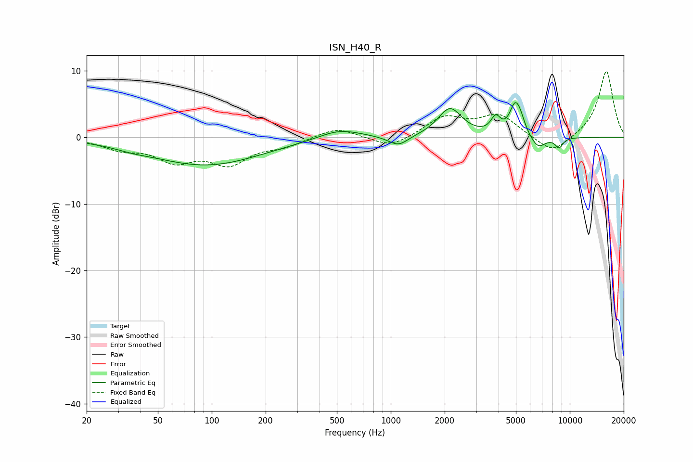

# ISN_H40_R
See [usage instructions](https://github.com/jaakkopasanen/AutoEq#usage) for more options and info.

### Parametric EQs
Apply preamp of -5.3 dB when using parametric equalizer.

|   # | Type    |   Fc (Hz) |    Q |   Gain (dB) |
|-----|---------|-----------|------|-------------|
|   1 | Peaking |        36 | 1.58 |        -0.4 |
|   2 | Peaking |        93 | 0.46 |        -4.1 |
|   3 | Peaking |       516 | 1.19 |         1.5 |
|   4 | Peaking |      1102 | 2.53 |        -1.6 |
|   5 | Peaking |      2141 | 2.12 |         4.3 |
|   6 | Peaking |      3856 | 5.26 |         2.3 |
|   7 | Peaking |      4916 | 4.77 |         3.6 |
|   8 | Peaking |      5268 | 4.88 |         2.1 |
|   9 | Peaking |      6642 | 3.29 |        -1.9 |
|  10 | Peaking |      8709 | 6    |        -1.5 |

### Fixed Band EQs
When using fixed band (also called graphic) equalizer, apply preamp of **-10.0 dB** (if available) and set gains manually with these parameters.

|   # | Type    |   Fc (Hz) |    Q |   Gain (dB) |
|-----|---------|-----------|------|-------------|
|   1 | Peaking |        31 | 1.41 |        -1.5 |
|   2 | Peaking |        62 | 1.41 |        -3.2 |
|   3 | Peaking |       125 | 1.41 |        -3.6 |
|   4 | Peaking |       250 | 1.41 |        -1.1 |
|   5 | Peaking |       500 | 1.41 |         1.6 |
|   6 | Peaking |      1000 | 1.41 |        -1.7 |
|   7 | Peaking |      2000 | 1.41 |         3   |
|   8 | Peaking |      4000 | 1.41 |         3.3 |
|   9 | Peaking |      8000 | 1.41 |        -2.7 |
|  10 | Peaking |     16000 | 1.41 |        10.1 |

### Graphs

