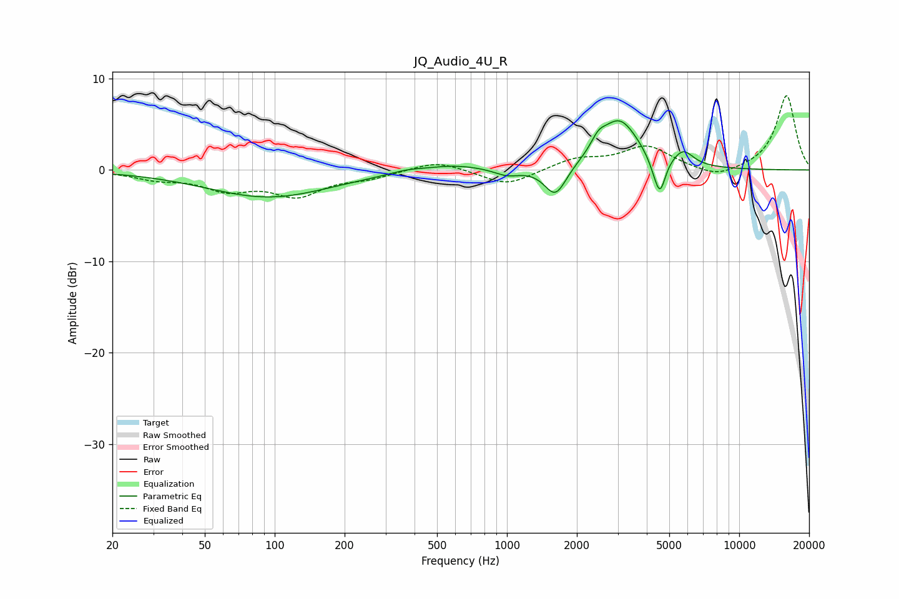

# JQ_Audio_4U_R
See [usage instructions](https://github.com/jaakkopasanen/AutoEq#usage) for more options and info.

### Parametric EQs
Apply preamp of -5.5 dB when using parametric equalizer.

|   # | Type    |   Fc (Hz) |    Q |   Gain (dB) |
|-----|---------|-----------|------|-------------|
|   1 | Peaking |        94 | 0.53 |        -3   |
|   2 | Peaking |       371 | 1.92 |         0.3 |
|   3 | Peaking |       588 | 1.16 |         0.7 |
|   4 | Peaking |       999 | 2.67 |        -0.7 |
|   5 | Peaking |      1618 | 2.98 |        -3.3 |
|   6 | Peaking |      2473 | 4.5  |         1.2 |
|   7 | Peaking |      3048 | 1.67 |         5.4 |
|   8 | Peaking |      4310 | 4.67 |        -1   |
|   9 | Peaking |      4564 | 5.99 |        -3.5 |
|  10 | Peaking |      5744 | 3.24 |         1.6 |

### Fixed Band EQs
When using fixed band (also called graphic) equalizer, apply preamp of **-8.2 dB** (if available) and set gains manually with these parameters.

|   # | Type    |   Fc (Hz) |    Q |   Gain (dB) |
|-----|---------|-----------|------|-------------|
|   1 | Peaking |        31 | 1.41 |        -0.8 |
|   2 | Peaking |        62 | 1.41 |        -1.9 |
|   3 | Peaking |       125 | 1.41 |        -2.6 |
|   4 | Peaking |       250 | 1.41 |        -0.7 |
|   5 | Peaking |       500 | 1.41 |         1.1 |
|   6 | Peaking |      1000 | 1.41 |        -1.7 |
|   7 | Peaking |      2000 | 1.41 |         1.2 |
|   8 | Peaking |      4000 | 1.41 |         2.5 |
|   9 | Peaking |      8000 | 1.41 |        -1   |
|  10 | Peaking |     16000 | 1.41 |         8.2 |

### Graphs

