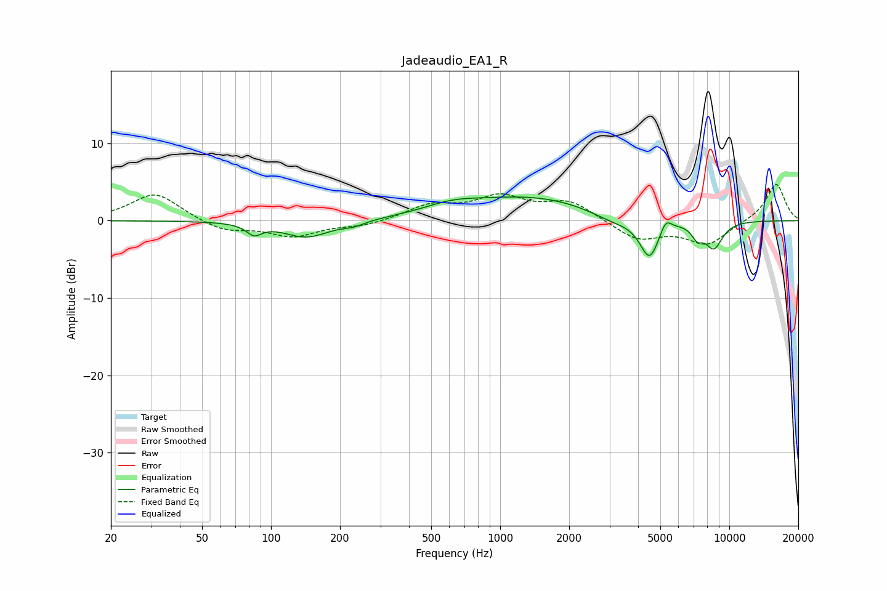

# Jadeaudio_EA1_R
See [usage instructions](https://github.com/jaakkopasanen/AutoEq#usage) for more options and info.

### Parametric EQs
Apply preamp of -3.2 dB when using parametric equalizer.

|   # | Type    |   Fc (Hz) |    Q |   Gain (dB) |
|-----|---------|-----------|------|-------------|
|   1 | Peaking |        84 | 4.29 |        -1.4 |
|   2 | Peaking |       143 | 1.4  |        -2.2 |
|   3 | Peaking |       229 | 2.89 |        -0.5 |
|   4 | Peaking |       613 | 1.17 |         1.1 |
|   5 | Peaking |      1388 | 0.49 |         3   |
|   6 | Peaking |      3124 | 1.35 |        -1.3 |
|   7 | Peaking |      4486 | 3.33 |        -5   |
|   8 | Peaking |      5277 | 5.79 |         1.6 |
|   9 | Peaking |      7245 | 5.3  |        -1.6 |
|  10 | Peaking |      8559 | 3.3  |        -3.4 |

### Fixed Band EQs
When using fixed band (also called graphic) equalizer, apply preamp of **-4.8 dB** (if available) and set gains manually with these parameters.

|   # | Type    |   Fc (Hz) |    Q |   Gain (dB) |
|-----|---------|-----------|------|-------------|
|   1 | Peaking |        31 | 1.41 |         3.6 |
|   2 | Peaking |        62 | 1.41 |        -1.4 |
|   3 | Peaking |       125 | 1.41 |        -1.9 |
|   4 | Peaking |       250 | 1.41 |        -0.7 |
|   5 | Peaking |       500 | 1.41 |         1.9 |
|   6 | Peaking |      1000 | 1.41 |         2.8 |
|   7 | Peaking |      2000 | 1.41 |         2.4 |
|   8 | Peaking |      4000 | 1.41 |        -2.5 |
|   9 | Peaking |      8000 | 1.41 |        -3   |
|  10 | Peaking |     16000 | 1.41 |         4.9 |

### Graphs

