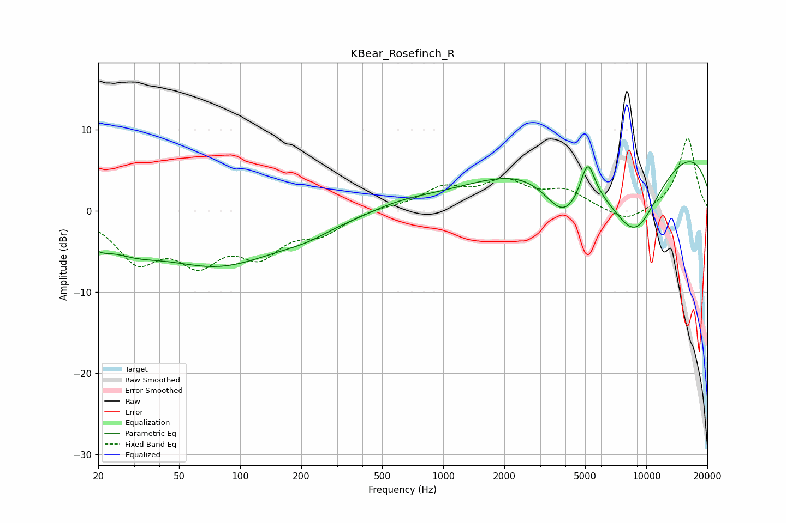

# KBear_Rosefinch_R
See [usage instructions](https://github.com/jaakkopasanen/AutoEq#usage) for more options and info.

### Parametric EQs
Apply preamp of -6.2 dB when using parametric equalizer.

|   # | Type    |   Fc (Hz) |    Q |   Gain (dB) |
|-----|---------|-----------|------|-------------|
|   1 | Peaking |        20 | 2.41 |        -1.8 |
|   2 | Peaking |        29 | 0.99 |        -2.4 |
|   3 | Peaking |        78 | 0.46 |        -6.3 |
|   4 | Peaking |       250 | 0.95 |        -2.3 |
|   5 | Peaking |       272 | 1.28 |         1.2 |
|   6 | Peaking |       615 | 0.82 |         0.9 |
|   7 | Peaking |      3921 | 1.37 |        -6   |
|   8 | Peaking |      5148 | 3.88 |         4.8 |
|   9 | Peaking |      8752 | 0.77 |       -12.9 |
|  10 | Peaking |      8865 | 0.18 |        11.4 |

### Fixed Band EQs
When using fixed band (also called graphic) equalizer, apply preamp of **-9.1 dB** (if available) and set gains manually with these parameters.

|   # | Type    |   Fc (Hz) |    Q |   Gain (dB) |
|-----|---------|-----------|------|-------------|
|   1 | Peaking |        31 | 1.41 |        -5.6 |
|   2 | Peaking |        62 | 1.41 |        -5.4 |
|   3 | Peaking |       125 | 1.41 |        -4.6 |
|   4 | Peaking |       250 | 1.41 |        -2.4 |
|   5 | Peaking |       500 | 1.41 |         0.4 |
|   6 | Peaking |      1000 | 1.41 |         2.6 |
|   7 | Peaking |      2000 | 1.41 |         3.2 |
|   8 | Peaking |      4000 | 1.41 |         2.2 |
|   9 | Peaking |      8000 | 1.41 |        -1.6 |
|  10 | Peaking |     16000 | 1.41 |         9.1 |

### Graphs

