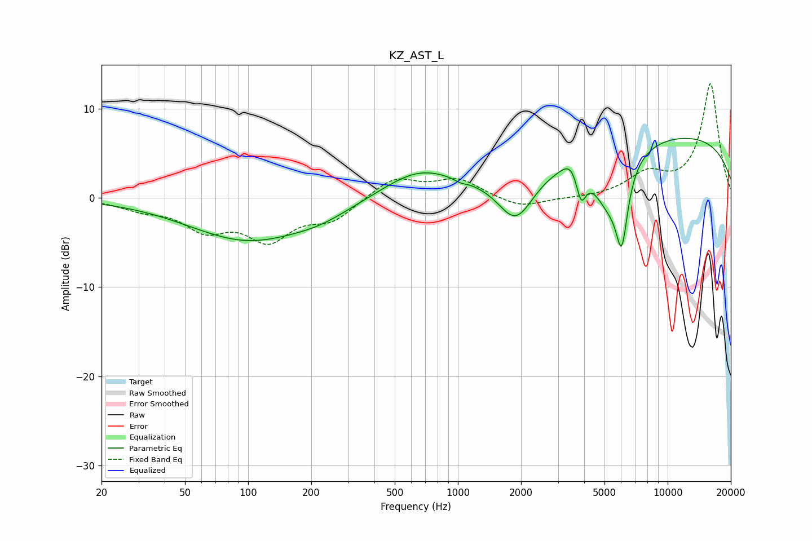

# KZ_AST_L
See [usage instructions](https://github.com/jaakkopasanen/AutoEq#usage) for more options and info.

### Parametric EQs
Apply preamp of -6.8 dB when using parametric equalizer.

|   # | Type    |   Fc (Hz) |    Q |   Gain (dB) |
|-----|---------|-----------|------|-------------|
|   1 | Peaking |       100 | 0.49 |        -4.7 |
|   2 | Peaking |       225 | 1    |        -1   |
|   3 | Peaking |       654 | 0.82 |         3   |
|   4 | Peaking |      1027 | 4.96 |        -0.3 |
|   5 | Peaking |      1892 | 1.6  |        -5.5 |
|   6 | Peaking |      3476 | 3.32 |         1.5 |
|   7 | Peaking |      3865 | 6    |        -3.5 |
|   8 | Peaking |      5247 | 1.69 |        -6   |
|   9 | Peaking |      6043 | 4.93 |        -7.4 |
|  10 | Peaking |      9397 | 0.19 |         7.2 |

### Fixed Band EQs
When using fixed band (also called graphic) equalizer, apply preamp of **-12.9 dB** (if available) and set gains manually with these parameters.

|   # | Type    |   Fc (Hz) |    Q |   Gain (dB) |
|-----|---------|-----------|------|-------------|
|   1 | Peaking |        31 | 1.41 |        -1   |
|   2 | Peaking |        62 | 1.41 |        -3.1 |
|   3 | Peaking |       125 | 1.41 |        -4.3 |
|   4 | Peaking |       250 | 1.41 |        -2.3 |
|   5 | Peaking |       500 | 1.41 |         2.3 |
|   6 | Peaking |      1000 | 1.41 |         2   |
|   7 | Peaking |      2000 | 1.41 |        -1.2 |
|   8 | Peaking |      4000 | 1.41 |        -0.1 |
|   9 | Peaking |      8000 | 1.41 |         2.4 |
|  10 | Peaking |     16000 | 1.41 |        12.8 |

### Graphs

