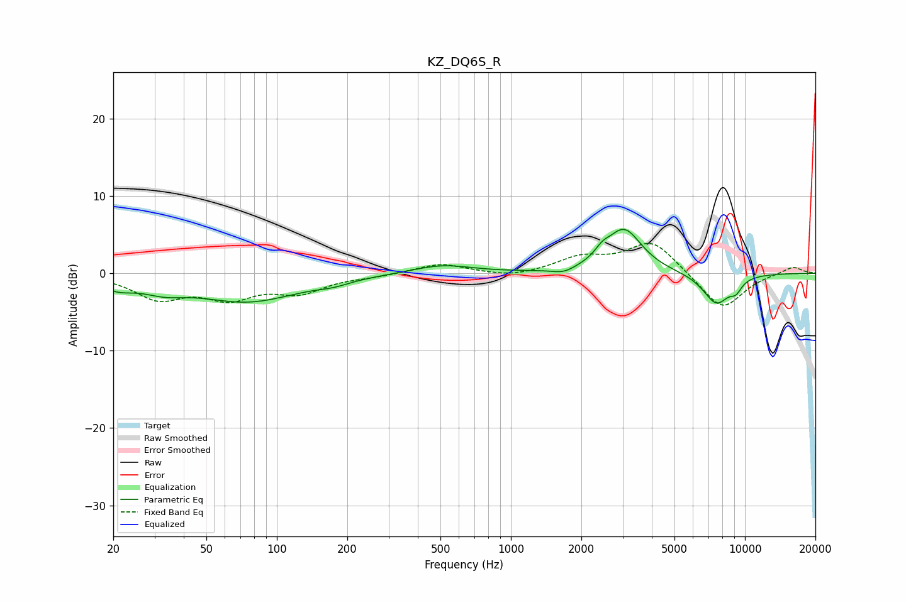

# KZ_DQ6S_R
See [usage instructions](https://github.com/jaakkopasanen/AutoEq#usage) for more options and info.

### Parametric EQs
Apply preamp of -5.8 dB when using parametric equalizer.

|   # | Type    |   Fc (Hz) |    Q |   Gain (dB) |
|-----|---------|-----------|------|-------------|
|   1 | Peaking |        21 | 1.98 |        -1.3 |
|   2 | Peaking |        33 | 1.52 |        -1.3 |
|   3 | Peaking |        75 | 0.64 |        -3.5 |
|   4 | Peaking |       174 | 1.98 |        -0.5 |
|   5 | Peaking |       507 | 1.1  |         1.1 |
|   6 | Peaking |      1681 | 2.86 |        -0.7 |
|   7 | Peaking |      2456 | 4.47 |         1   |
|   8 | Peaking |      3047 | 1.86 |         5.6 |
|   9 | Peaking |      7551 | 2.28 |        -4   |
|  10 | Peaking |      9157 | 5.11 |        -1.2 |

### Fixed Band EQs
When using fixed band (also called graphic) equalizer, apply preamp of **-4.0 dB** (if available) and set gains manually with these parameters.

|   # | Type    |   Fc (Hz) |    Q |   Gain (dB) |
|-----|---------|-----------|------|-------------|
|   1 | Peaking |        31 | 1.41 |        -3   |
|   2 | Peaking |        62 | 1.41 |        -2.8 |
|   3 | Peaking |       125 | 1.41 |        -2.2 |
|   4 | Peaking |       250 | 1.41 |        -0.3 |
|   5 | Peaking |       500 | 1.41 |         1.3 |
|   6 | Peaking |      1000 | 1.41 |        -0.6 |
|   7 | Peaking |      2000 | 1.41 |         1.9 |
|   8 | Peaking |      4000 | 1.41 |         4.2 |
|   9 | Peaking |      8000 | 1.41 |        -4.8 |
|  10 | Peaking |     16000 | 1.41 |         0.9 |

### Graphs

