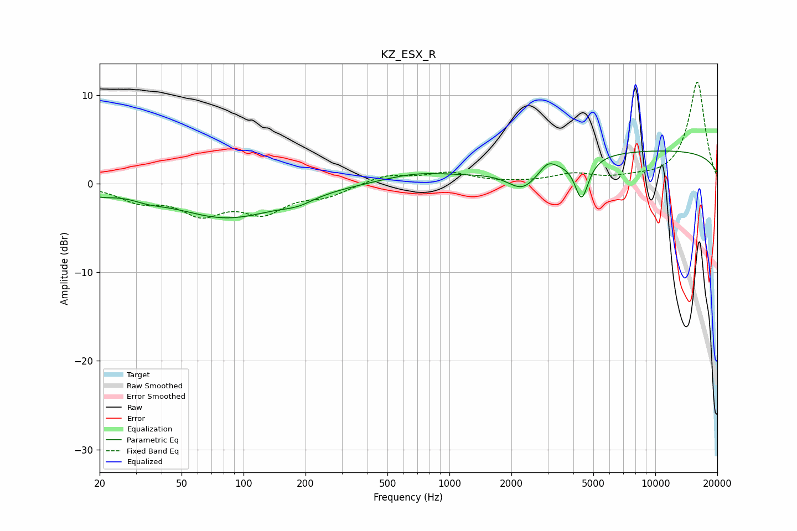

# KZ_ESX_R
See [usage instructions](https://github.com/jaakkopasanen/AutoEq#usage) for more options and info.

### Parametric EQs
Apply preamp of -3.8 dB when using parametric equalizer.

|   # | Type    |   Fc (Hz) |    Q |   Gain (dB) |
|-----|---------|-----------|------|-------------|
|   1 | Peaking |        20 | 2.01 |        -0.7 |
|   2 | Peaking |        34 | 1.8  |        -0.5 |
|   3 | Peaking |        83 | 0.55 |        -3.7 |
|   4 | Peaking |       183 | 1.82 |        -0.7 |
|   5 | Peaking |       691 | 0.82 |         1   |
|   6 | Peaking |      2272 | 1.9  |        -2.5 |
|   7 | Peaking |      3005 | 3.82 |         1.1 |
|   8 | Peaking |      4385 | 4.27 |        -4.5 |
|   9 | Peaking |      4819 | 4.54 |        -0.1 |
|  10 | Peaking |     10000 | 0.18 |         3.8 |

### Fixed Band EQs
When using fixed band (also called graphic) equalizer, apply preamp of **-11.6 dB** (if available) and set gains manually with these parameters.

|   # | Type    |   Fc (Hz) |    Q |   Gain (dB) |
|-----|---------|-----------|------|-------------|
|   1 | Peaking |        31 | 1.41 |        -1.7 |
|   2 | Peaking |        62 | 1.41 |        -3   |
|   3 | Peaking |       125 | 1.41 |        -2.9 |
|   4 | Peaking |       250 | 1.41 |        -1.2 |
|   5 | Peaking |       500 | 1.41 |         1   |
|   6 | Peaking |      1000 | 1.41 |         1.2 |
|   7 | Peaking |      2000 | 1.41 |         0   |
|   8 | Peaking |      4000 | 1.41 |         1   |
|   9 | Peaking |      8000 | 1.41 |         0.4 |
|  10 | Peaking |     16000 | 1.41 |        11.5 |

### Graphs

