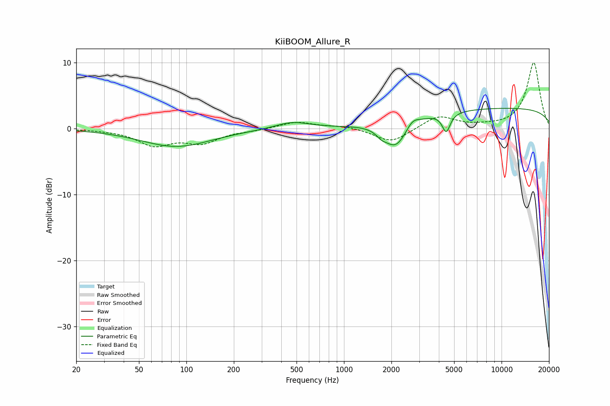

# KiiBOOM_Allure_R
See [usage instructions](https://github.com/jaakkopasanen/AutoEq#usage) for more options and info.

### Parametric EQs
Apply preamp of -3.2 dB when using parametric equalizer.

|   # | Type    |   Fc (Hz) |    Q |   Gain (dB) |
|-----|---------|-----------|------|-------------|
|   1 | Peaking |        86 | 0.63 |        -2.7 |
|   2 | Peaking |       470 | 1.33 |         1.1 |
|   3 | Peaking |      1731 | 4.56 |        -0.9 |
|   4 | Peaking |      1754 | 5.23 |         0.2 |
|   5 | Peaking |      2111 | 2    |        -3.6 |
|   6 | Peaking |      2346 | 1.91 |        -0.6 |
|   7 | Peaking |      2713 | 3.39 |         1.3 |
|   8 | Peaking |      4319 | 5.54 |         0.1 |
|   9 | Peaking |      4452 | 5.56 |        -2.9 |
|  10 | Peaking |     10000 | 0.18 |         3.1 |

### Fixed Band EQs
When using fixed band (also called graphic) equalizer, apply preamp of **-10.1 dB** (if available) and set gains manually with these parameters.

|   # | Type    |   Fc (Hz) |    Q |   Gain (dB) |
|-----|---------|-----------|------|-------------|
|   1 | Peaking |        31 | 1.41 |        -0.1 |
|   2 | Peaking |        62 | 1.41 |        -2.4 |
|   3 | Peaking |       125 | 1.41 |        -2   |
|   4 | Peaking |       250 | 1.41 |        -0.2 |
|   5 | Peaking |       500 | 1.41 |         1   |
|   6 | Peaking |      1000 | 1.41 |         0.4 |
|   7 | Peaking |      2000 | 1.41 |        -2.2 |
|   8 | Peaking |      4000 | 1.41 |         1.9 |
|   9 | Peaking |      8000 | 1.41 |         0.2 |
|  10 | Peaking |     16000 | 1.41 |        10   |

### Graphs

