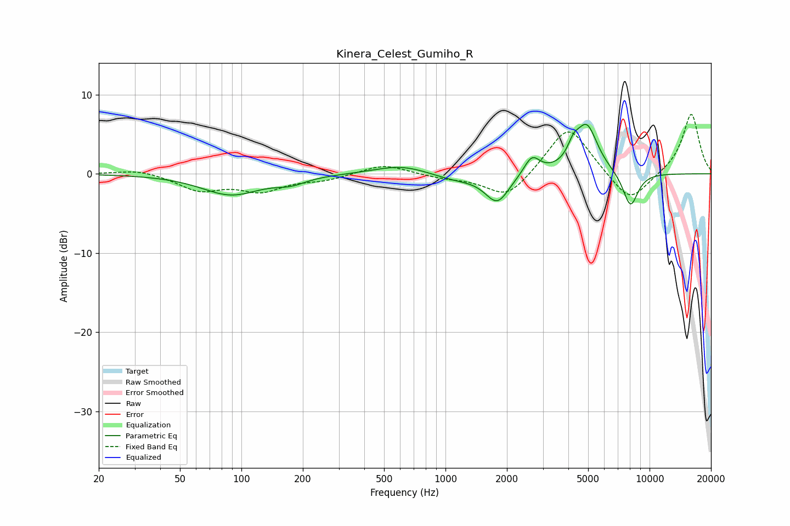

# Kinera_Celest_Gumiho_R
See [usage instructions](https://github.com/jaakkopasanen/AutoEq#usage) for more options and info.

### Parametric EQs
Apply preamp of -6.3 dB when using parametric equalizer.

|   # | Type    |   Fc (Hz) |    Q |   Gain (dB) |
|-----|---------|-----------|------|-------------|
|   1 | Peaking |        89 | 0.98 |        -2.6 |
|   2 | Peaking |       175 | 1.91 |        -0.8 |
|   3 | Peaking |       610 | 1.1  |         0.9 |
|   4 | Peaking |       612 | 1.01 |         0.3 |
|   5 | Peaking |      1101 | 1.25 |        -0.8 |
|   6 | Peaking |      1794 | 2.39 |        -3.6 |
|   7 | Peaking |      2650 | 3.64 |         2.3 |
|   8 | Peaking |      4236 | 5.06 |         1.7 |
|   9 | Peaking |      4922 | 2.57 |         6   |
|  10 | Peaking |      8061 | 3.48 |        -4.4 |

### Fixed Band EQs
When using fixed band (also called graphic) equalizer, apply preamp of **-7.6 dB** (if available) and set gains manually with these parameters.

|   # | Type    |   Fc (Hz) |    Q |   Gain (dB) |
|-----|---------|-----------|------|-------------|
|   1 | Peaking |        31 | 1.41 |         0.6 |
|   2 | Peaking |        62 | 1.41 |        -2   |
|   3 | Peaking |       125 | 1.41 |        -2   |
|   4 | Peaking |       250 | 1.41 |        -0.7 |
|   5 | Peaking |       500 | 1.41 |         1.3 |
|   6 | Peaking |      1000 | 1.41 |        -0.5 |
|   7 | Peaking |      2000 | 1.41 |        -3.2 |
|   8 | Peaking |      4000 | 1.41 |         6.3 |
|   9 | Peaking |      8000 | 1.41 |        -3.9 |
|  10 | Peaking |     16000 | 1.41 |         7.7 |

### Graphs

