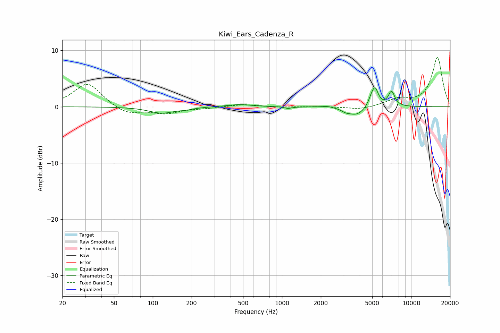

# Kiwi_Ears_Cadenza_R
See [usage instructions](https://github.com/jaakkopasanen/AutoEq#usage) for more options and info.

### Parametric EQs
Apply preamp of -3.5 dB when using parametric equalizer.

|   # | Type    |   Fc (Hz) |    Q |   Gain (dB) |
|-----|---------|-----------|------|-------------|
|   1 | Peaking |       117 | 1.43 |        -1.1 |
|   2 | Peaking |       182 | 2.71 |        -0.2 |
|   3 | Peaking |       469 | 1.5  |         0.4 |
|   4 | Peaking |      1115 | 5.07 |        -0.3 |
|   5 | Peaking |      2249 | 3.35 |         0.2 |
|   6 | Peaking |      3122 | 4.41 |        -0.4 |
|   7 | Peaking |      3786 | 2.16 |        -1.5 |
|   8 | Peaking |      4895 | 6    |         0.9 |
|   9 | Peaking |      5253 | 5.25 |         3.2 |
|  10 | Peaking |      7053 | 5.23 |         2.6 |

### Fixed Band EQs
When using fixed band (also called graphic) equalizer, apply preamp of **-8.8 dB** (if available) and set gains manually with these parameters.

|   # | Type    |   Fc (Hz) |    Q |   Gain (dB) |
|-----|---------|-----------|------|-------------|
|   1 | Peaking |        31 | 1.41 |         4.3 |
|   2 | Peaking |        62 | 1.41 |        -1.4 |
|   3 | Peaking |       125 | 1.41 |        -1.1 |
|   4 | Peaking |       250 | 1.41 |        -0.2 |
|   5 | Peaking |       500 | 1.41 |         0.4 |
|   6 | Peaking |      1000 | 1.41 |        -0.1 |
|   7 | Peaking |      2000 | 1.41 |         0   |
|   8 | Peaking |      4000 | 1.41 |        -0.5 |
|   9 | Peaking |      8000 | 1.41 |         1.2 |
|  10 | Peaking |     16000 | 1.41 |         8.7 |

### Graphs

