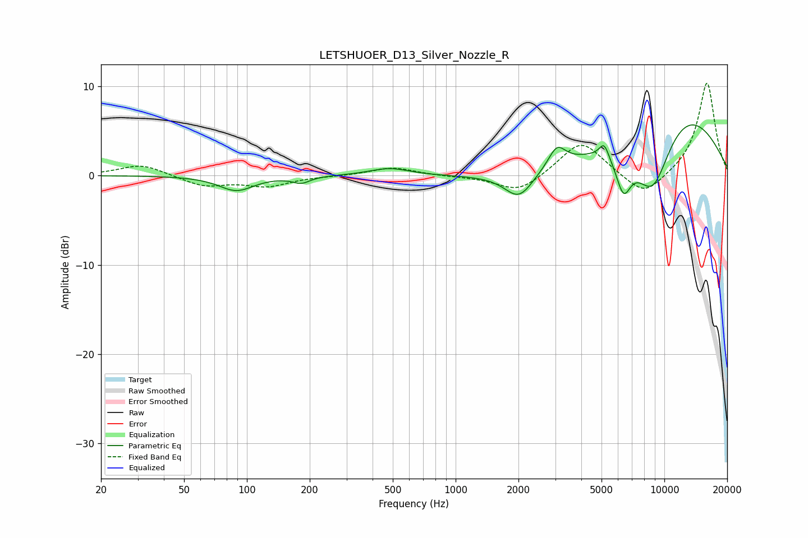

# LETSHUOER_D13_Silver_Nozzle_R
See [usage instructions](https://github.com/jaakkopasanen/AutoEq#usage) for more options and info.

### Parametric EQs
Apply preamp of -5.8 dB when using parametric equalizer.

|   # | Type    |   Fc (Hz) |    Q |   Gain (dB) |
|-----|---------|-----------|------|-------------|
|   1 | Peaking |        89 | 1.71 |        -1.7 |
|   2 | Peaking |       182 | 3.4  |        -0.7 |
|   3 | Peaking |       483 | 1.48 |         0.8 |
|   4 | Peaking |      2011 | 2.07 |        -2.9 |
|   5 | Peaking |      3057 | 3.41 |         2.3 |
|   6 | Peaking |      3559 | 0.39 |        -1   |
|   7 | Peaking |      5144 | 6    |         1.7 |
|   8 | Peaking |      6367 | 3.73 |        -4.2 |
|   9 | Peaking |      8786 | 1.18 |       -10.5 |
|  10 | Peaking |     10000 | 0.41 |        10.6 |

### Fixed Band EQs
When using fixed band (also called graphic) equalizer, apply preamp of **-10.4 dB** (if available) and set gains manually with these parameters.

|   # | Type    |   Fc (Hz) |    Q |   Gain (dB) |
|-----|---------|-----------|------|-------------|
|   1 | Peaking |        31 | 1.41 |         1.3 |
|   2 | Peaking |        62 | 1.41 |        -1.2 |
|   3 | Peaking |       125 | 1.41 |        -1.1 |
|   4 | Peaking |       250 | 1.41 |        -0   |
|   5 | Peaking |       500 | 1.41 |         0.9 |
|   6 | Peaking |      1000 | 1.41 |        -0.1 |
|   7 | Peaking |      2000 | 1.41 |        -2   |
|   8 | Peaking |      4000 | 1.41 |         4   |
|   9 | Peaking |      8000 | 1.41 |        -2.6 |
|  10 | Peaking |     16000 | 1.41 |        10.5 |

### Graphs

