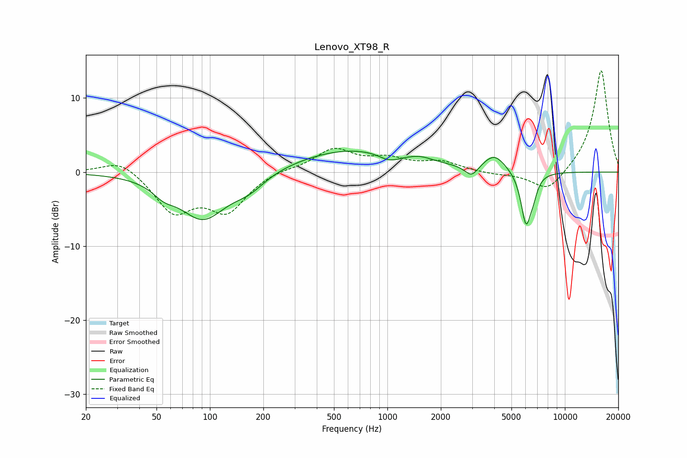

# Lenovo_XT98_R
See [usage instructions](https://github.com/jaakkopasanen/AutoEq#usage) for more options and info.

### Parametric EQs
Apply preamp of -2.9 dB when using parametric equalizer.

|   # | Type    |   Fc (Hz) |    Q |   Gain (dB) |
|-----|---------|-----------|------|-------------|
|   1 | Peaking |        55 | 2.28 |        -1.3 |
|   2 | Peaking |        91 | 1.06 |        -6.2 |
|   3 | Peaking |       166 | 1.54 |        -1.7 |
|   4 | Peaking |       639 | 0.43 |         3.1 |
|   5 | Peaking |      1027 | 2.33 |        -1.1 |
|   6 | Peaking |      1533 | 2.14 |         0.5 |
|   7 | Peaking |      2981 | 3.73 |        -1.6 |
|   8 | Peaking |      4006 | 2.22 |         2.2 |
|   9 | Peaking |      6040 | 4.77 |        -7   |
|  10 | Peaking |      6636 | 6    |        -1.6 |

### Fixed Band EQs
When using fixed band (also called graphic) equalizer, apply preamp of **-13.8 dB** (if available) and set gains manually with these parameters.

|   # | Type    |   Fc (Hz) |    Q |   Gain (dB) |
|-----|---------|-----------|------|-------------|
|   1 | Peaking |        31 | 1.41 |         1.9 |
|   2 | Peaking |        62 | 1.41 |        -5.2 |
|   3 | Peaking |       125 | 1.41 |        -5   |
|   4 | Peaking |       250 | 1.41 |         0.4 |
|   5 | Peaking |       500 | 1.41 |         3   |
|   6 | Peaking |      1000 | 1.41 |         1.5 |
|   7 | Peaking |      2000 | 1.41 |         1.3 |
|   8 | Peaking |      4000 | 1.41 |        -0.3 |
|   9 | Peaking |      8000 | 1.41 |        -2.9 |
|  10 | Peaking |     16000 | 1.41 |        13.9 |

### Graphs

