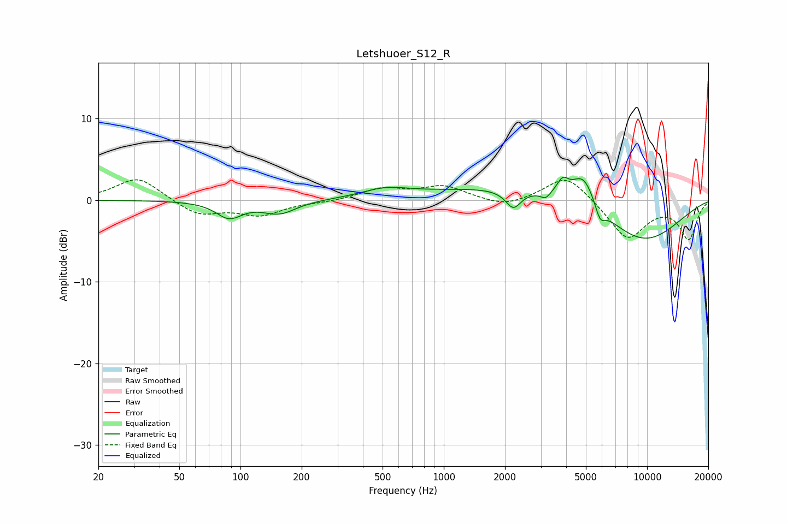

# Letshuoer_S12_R
See [usage instructions](https://github.com/jaakkopasanen/AutoEq#usage) for more options and info.

### Parametric EQs
Apply preamp of -2.9 dB when using parametric equalizer.

|   # | Type    |   Fc (Hz) |    Q |   Gain (dB) |
|-----|---------|-----------|------|-------------|
|   1 | Peaking |        88 | 2.22 |        -2   |
|   2 | Peaking |       155 | 1.7  |        -1.6 |
|   3 | Peaking |       516 | 1.24 |         1   |
|   4 | Peaking |      2197 | 3.8  |        -2.2 |
|   5 | Peaking |      2376 | 0.3  |         1.7 |
|   6 | Peaking |      3167 | 5.96 |        -0.8 |
|   7 | Peaking |      3844 | 4.98 |         1.7 |
|   8 | Peaking |      4861 | 2.37 |         3.8 |
|   9 | Peaking |      5871 | 5.63 |        -1.8 |
|  10 | Peaking |      9355 | 0.6  |        -5.4 |

### Fixed Band EQs
When using fixed band (also called graphic) equalizer, apply preamp of **-2.6 dB** (if available) and set gains manually with these parameters.

|   # | Type    |   Fc (Hz) |    Q |   Gain (dB) |
|-----|---------|-----------|------|-------------|
|   1 | Peaking |        31 | 1.41 |         2.9 |
|   2 | Peaking |        62 | 1.41 |        -1.8 |
|   3 | Peaking |       125 | 1.41 |        -1.7 |
|   4 | Peaking |       250 | 1.41 |        -0.2 |
|   5 | Peaking |       500 | 1.41 |         1.4 |
|   6 | Peaking |      1000 | 1.41 |         1.6 |
|   7 | Peaking |      2000 | 1.41 |        -0.9 |
|   8 | Peaking |      4000 | 1.41 |         3.2 |
|   9 | Peaking |      8000 | 1.41 |        -4.7 |
|  10 | Peaking |     16000 | 1.41 |        -4.7 |

### Graphs

