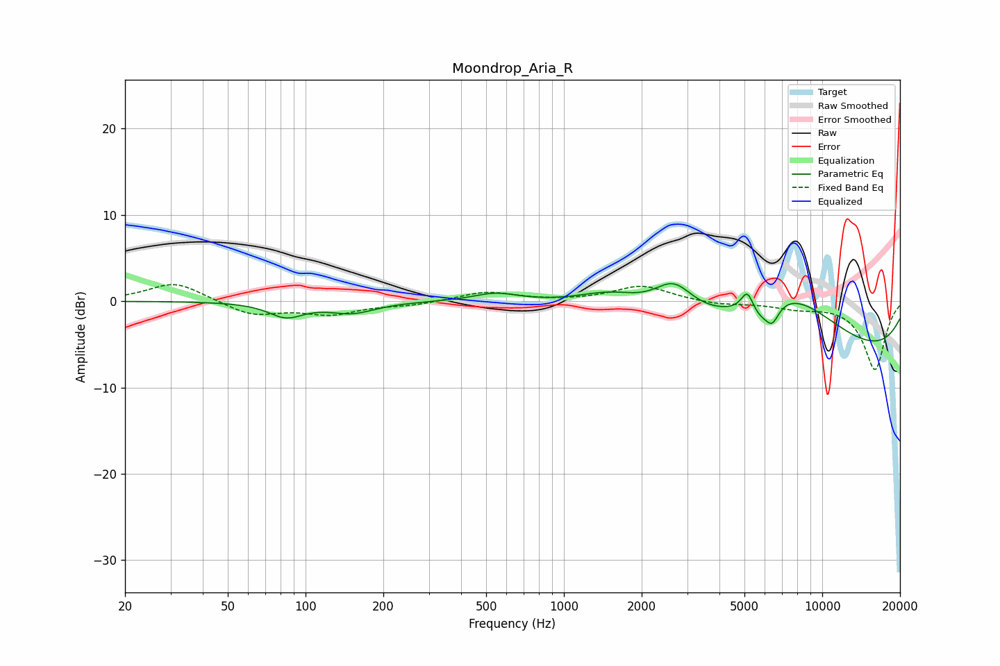

# Moondrop_Aria_R
See [usage instructions](https://github.com/jaakkopasanen/AutoEq#usage) for more options and info.

### Parametric EQs
Apply preamp of -2.1 dB when using parametric equalizer.

|   # | Type    |   Fc (Hz) |    Q |   Gain (dB) |
|-----|---------|-----------|------|-------------|
|   1 | Peaking |        84 | 2.1  |        -1.7 |
|   2 | Peaking |       152 | 1.58 |        -1.3 |
|   3 | Peaking |       546 | 1.6  |         1   |
|   4 | Peaking |      1519 | 1.07 |         2   |
|   5 | Peaking |      2658 | 1.85 |         3.6 |
|   6 | Peaking |      5130 | 5.94 |         2.4 |
|   7 | Peaking |      5761 | 2.82 |        -1.8 |
|   8 | Peaking |      6407 | 5.23 |        -2   |
|   9 | Peaking |      7331 | 0.63 |         7.2 |
|  10 | Peaking |      9790 | 0.19 |        -7.1 |

### Fixed Band EQs
When using fixed band (also called graphic) equalizer, apply preamp of **-2.0 dB** (if available) and set gains manually with these parameters.

|   # | Type    |   Fc (Hz) |    Q |   Gain (dB) |
|-----|---------|-----------|------|-------------|
|   1 | Peaking |        31 | 1.41 |         2.2 |
|   2 | Peaking |        62 | 1.41 |        -1.6 |
|   3 | Peaking |       125 | 1.41 |        -1.4 |
|   4 | Peaking |       250 | 1.41 |        -0.4 |
|   5 | Peaking |       500 | 1.41 |         1.1 |
|   6 | Peaking |      1000 | 1.41 |        -0   |
|   7 | Peaking |      2000 | 1.41 |         1.8 |
|   8 | Peaking |      4000 | 1.41 |        -0.4 |
|   9 | Peaking |      8000 | 1.41 |        -0.7 |
|  10 | Peaking |     16000 | 1.41 |        -7.9 |

### Graphs

