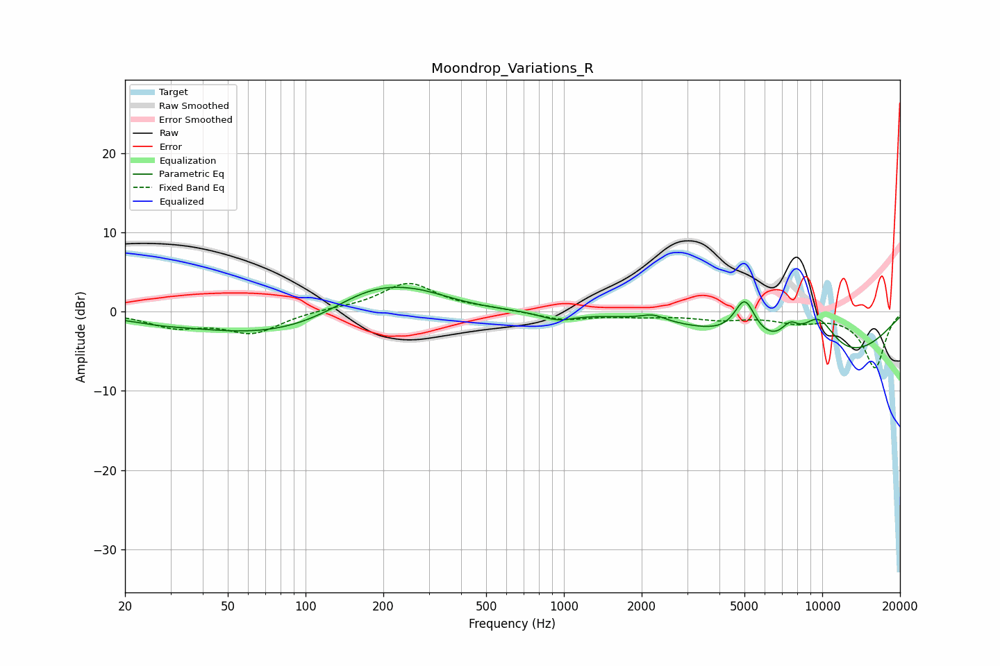

# Moondrop_Variations_R
See [usage instructions](https://github.com/jaakkopasanen/AutoEq#usage) for more options and info.

### Parametric EQs
Apply preamp of -3.2 dB when using parametric equalizer.

|   # | Type    |   Fc (Hz) |    Q |   Gain (dB) |
|-----|---------|-----------|------|-------------|
|   1 | Peaking |        27 | 1.4  |        -0.4 |
|   2 | Peaking |        82 | 0.4  |        -3.4 |
|   3 | Peaking |       178 | 0.82 |         4   |
|   4 | Peaking |       273 | 0.99 |         1.6 |
|   5 | Peaking |       945 | 2.16 |        -1   |
|   6 | Peaking |      2217 | 3.12 |         0.8 |
|   7 | Peaking |      5015 | 3.4  |         4.9 |
|   8 | Peaking |      7501 | 3.82 |         2   |
|   9 | Peaking |      9647 | 1.68 |         5.4 |
|  10 | Peaking |     10000 | 0.39 |        -6.8 |

### Fixed Band EQs
When using fixed band (also called graphic) equalizer, apply preamp of **-3.7 dB** (if available) and set gains manually with these parameters.

|   # | Type    |   Fc (Hz) |    Q |   Gain (dB) |
|-----|---------|-----------|------|-------------|
|   1 | Peaking |        31 | 1.41 |        -1.8 |
|   2 | Peaking |        62 | 1.41 |        -2.6 |
|   3 | Peaking |       125 | 1.41 |         0.3 |
|   4 | Peaking |       250 | 1.41 |         3.6 |
|   5 | Peaking |       500 | 1.41 |         0.3 |
|   6 | Peaking |      1000 | 1.41 |        -1   |
|   7 | Peaking |      2000 | 1.41 |        -0.5 |
|   8 | Peaking |      4000 | 1.41 |        -0.8 |
|   9 | Peaking |      8000 | 1.41 |        -1.1 |
|  10 | Peaking |     16000 | 1.41 |        -7   |

### Graphs

