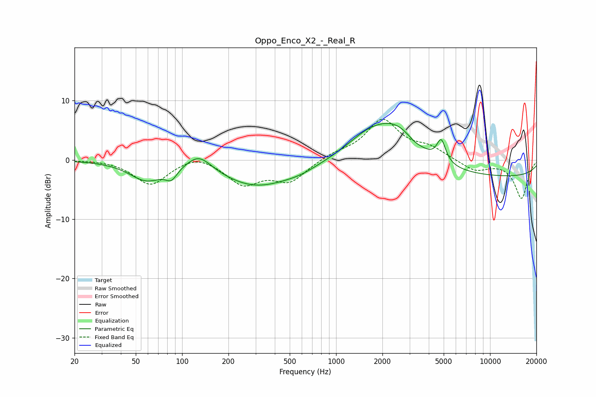

# Oppo_Enco_X2_-_Real_R
See [usage instructions](https://github.com/jaakkopasanen/AutoEq#usage) for more options and info.

### Parametric EQs
Apply preamp of -6.3 dB when using parametric equalizer.

|   # | Type    |   Fc (Hz) |    Q |   Gain (dB) |
|-----|---------|-----------|------|-------------|
|   1 | Peaking |        59 | 1.29 |        -3.2 |
|   2 | Peaking |        85 | 3.82 |        -1.8 |
|   3 | Peaking |       129 | 1.75 |         2.7 |
|   4 | Peaking |       301 | 0.61 |        -4.3 |
|   5 | Peaking |       585 | 1.19 |        -0.8 |
|   6 | Peaking |      1658 | 0.93 |         3.9 |
|   7 | Peaking |      2533 | 0.98 |         5.3 |
|   8 | Peaking |      3208 | 3.17 |        -0.5 |
|   9 | Peaking |      4820 | 4.89 |         3.7 |
|  10 | Peaking |     10000 | 0.18 |        -2.9 |

### Fixed Band EQs
When using fixed band (also called graphic) equalizer, apply preamp of **-7.0 dB** (if available) and set gains manually with these parameters.

|   # | Type    |   Fc (Hz) |    Q |   Gain (dB) |
|-----|---------|-----------|------|-------------|
|   1 | Peaking |        31 | 1.41 |         0.1 |
|   2 | Peaking |        62 | 1.41 |        -4.2 |
|   3 | Peaking |       125 | 1.41 |         1.2 |
|   4 | Peaking |       250 | 1.41 |        -3.9 |
|   5 | Peaking |       500 | 1.41 |        -3.5 |
|   6 | Peaking |      1000 | 1.41 |         0.9 |
|   7 | Peaking |      2000 | 1.41 |         6.6 |
|   8 | Peaking |      4000 | 1.41 |         1.8 |
|   9 | Peaking |      8000 | 1.41 |        -1.8 |
|  10 | Peaking |     16000 | 1.41 |        -6.5 |

### Graphs

