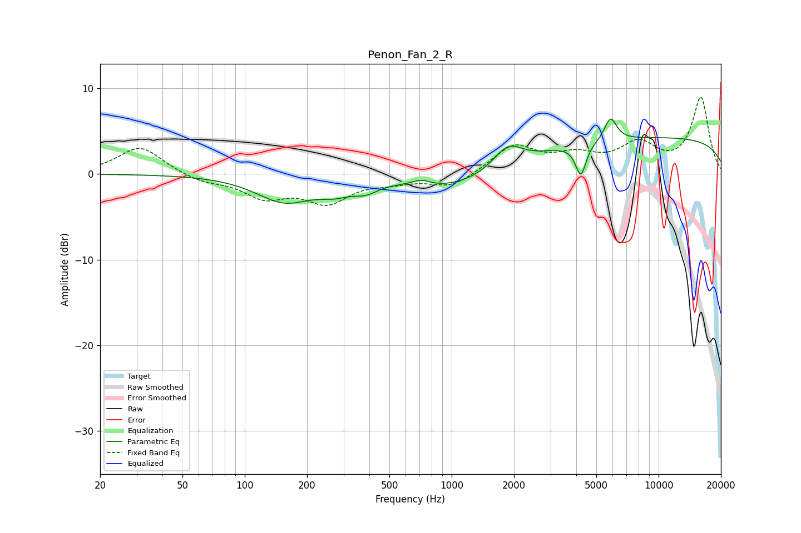

# Penon_Fan_2_R
See [usage instructions](https://github.com/jaakkopasanen/AutoEq#usage) for more options and info.

### Parametric EQs
Apply preamp of -6.5 dB when using parametric equalizer.

|   # | Type    |   Fc (Hz) |    Q |   Gain (dB) |
|-----|---------|-----------|------|-------------|
|   1 | Peaking |       155 | 1.03 |        -3.1 |
|   2 | Peaking |       274 | 1.74 |        -1.2 |
|   3 | Peaking |       385 | 2.34 |        -1.1 |
|   4 | Peaking |       710 | 3.3  |         0.6 |
|   5 | Peaking |      1037 | 0.67 |        -2   |
|   6 | Peaking |      1867 | 2.04 |         2.5 |
|   7 | Peaking |      3074 | 4.67 |         0   |
|   8 | Peaking |      4208 | 5.65 |        -3.7 |
|   9 | Peaking |      5858 | 4.65 |         2.7 |
|  10 | Peaking |     10000 | 0.18 |         4.2 |

### Fixed Band EQs
When using fixed band (also called graphic) equalizer, apply preamp of **-9.0 dB** (if available) and set gains manually with these parameters.

|   # | Type    |   Fc (Hz) |    Q |   Gain (dB) |
|-----|---------|-----------|------|-------------|
|   1 | Peaking |        31 | 1.41 |         3.2 |
|   2 | Peaking |        62 | 1.41 |        -0.9 |
|   3 | Peaking |       125 | 1.41 |        -2.5 |
|   4 | Peaking |       250 | 1.41 |        -3.1 |
|   5 | Peaking |       500 | 1.41 |        -0.7 |
|   6 | Peaking |      1000 | 1.41 |        -1.6 |
|   7 | Peaking |      2000 | 1.41 |         3.3 |
|   8 | Peaking |      4000 | 1.41 |         1.8 |
|   9 | Peaking |      8000 | 1.41 |         3.2 |
|  10 | Peaking |     16000 | 1.41 |         8.8 |

### Graphs

