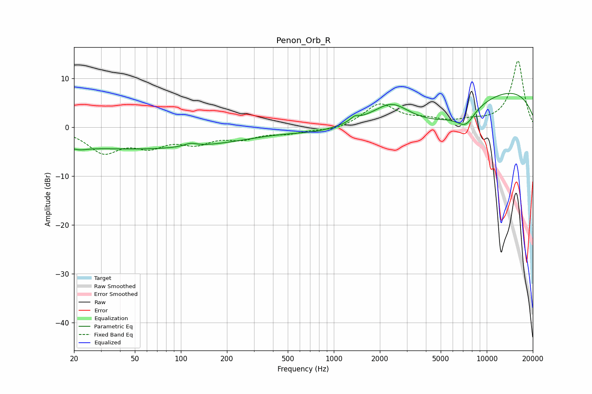

# Penon_Orb_R
See [usage instructions](https://github.com/jaakkopasanen/AutoEq#usage) for more options and info.

### Parametric EQs
Apply preamp of -7.0 dB when using parametric equalizer.

|   # | Type    |   Fc (Hz) |    Q |   Gain (dB) |
|-----|---------|-----------|------|-------------|
|   1 | Peaking |        20 | 3.38 |         3.2 |
|   2 | Peaking |        20 | 3.05 |        -3.9 |
|   3 | Peaking |        53 | 0.18 |        -4.4 |
|   4 | Peaking |       115 | 3.38 |         0.7 |
|   5 | Peaking |       841 | 0.78 |        -1.4 |
|   6 | Peaking |      1371 | 5.6  |         0.8 |
|   7 | Peaking |      2394 | 1.3  |         3.5 |
|   8 | Peaking |      4673 | 0.45 |        -7.7 |
|   9 | Peaking |      7282 | 2.24 |        -3.2 |
|  10 | Peaking |      8334 | 0.18 |         9.9 |

### Fixed Band EQs
When using fixed band (also called graphic) equalizer, apply preamp of **-13.6 dB** (if available) and set gains manually with these parameters.

|   # | Type    |   Fc (Hz) |    Q |   Gain (dB) |
|-----|---------|-----------|------|-------------|
|   1 | Peaking |        31 | 1.41 |        -4.8 |
|   2 | Peaking |        62 | 1.41 |        -3.2 |
|   3 | Peaking |       125 | 1.41 |        -2.8 |
|   4 | Peaking |       250 | 1.41 |        -1.9 |
|   5 | Peaking |       500 | 1.41 |        -1.1 |
|   6 | Peaking |      1000 | 1.41 |        -0.8 |
|   7 | Peaking |      2000 | 1.41 |         4.7 |
|   8 | Peaking |      4000 | 1.41 |         1.2 |
|   9 | Peaking |      8000 | 1.41 |         0.9 |
|  10 | Peaking |     16000 | 1.41 |        13.6 |

### Graphs

