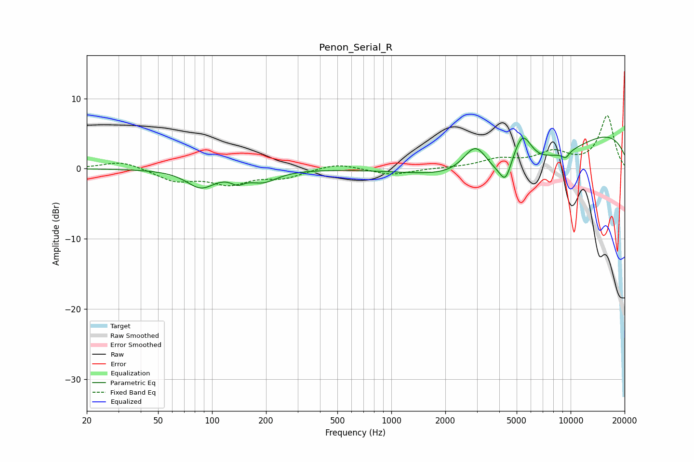

# Penon_Serial_R
See [usage instructions](https://github.com/jaakkopasanen/AutoEq#usage) for more options and info.

### Parametric EQs
Apply preamp of -4.6 dB when using parametric equalizer.

|   # | Type    |   Fc (Hz) |    Q |   Gain (dB) |
|-----|---------|-----------|------|-------------|
|   1 | Peaking |        87 | 1.8  |        -2.5 |
|   2 | Peaking |       139 | 3.8  |        -1.1 |
|   3 | Peaking |       193 | 1.77 |        -1.6 |
|   4 | Peaking |      2952 | 1.96 |         5   |
|   5 | Peaking |      4332 | 4.55 |        -2.6 |
|   6 | Peaking |      4732 | 0.44 |        -8.3 |
|   7 | Peaking |      5363 | 2.39 |         6.1 |
|   8 | Peaking |      7313 | 1.44 |         0.7 |
|   9 | Peaking |      9381 | 6    |        -0.9 |
|  10 | Peaking |     10000 | 0.2  |         6.6 |

### Fixed Band EQs
When using fixed band (also called graphic) equalizer, apply preamp of **-7.6 dB** (if available) and set gains manually with these parameters.

|   # | Type    |   Fc (Hz) |    Q |   Gain (dB) |
|-----|---------|-----------|------|-------------|
|   1 | Peaking |        31 | 1.41 |         1.1 |
|   2 | Peaking |        62 | 1.41 |        -1.7 |
|   3 | Peaking |       125 | 1.41 |        -2   |
|   4 | Peaking |       250 | 1.41 |        -1.2 |
|   5 | Peaking |       500 | 1.41 |         0.8 |
|   6 | Peaking |      1000 | 1.41 |        -0.9 |
|   7 | Peaking |      2000 | 1.41 |         0.1 |
|   8 | Peaking |      4000 | 1.41 |         1.2 |
|   9 | Peaking |      8000 | 1.41 |         2.1 |
|  10 | Peaking |     16000 | 1.41 |         7.5 |

### Graphs

