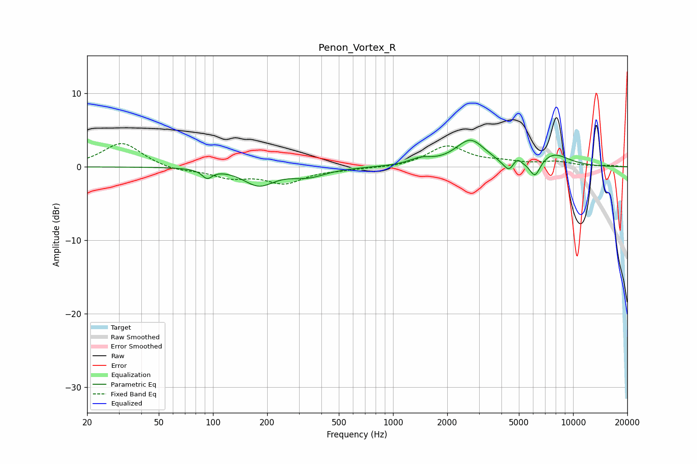

# Penon_Vortex_R
See [usage instructions](https://github.com/jaakkopasanen/AutoEq#usage) for more options and info.

### Parametric EQs
Apply preamp of -3.7 dB when using parametric equalizer.

|   # | Type    |   Fc (Hz) |    Q |   Gain (dB) |
|-----|---------|-----------|------|-------------|
|   1 | Peaking |        93 | 5.15 |        -1.2 |
|   2 | Peaking |       180 | 1.67 |        -2.4 |
|   3 | Peaking |       337 | 1.43 |        -1.2 |
|   4 | Peaking |      1418 | 2.25 |         0.8 |
|   5 | Peaking |      2691 | 1.72 |         3.5 |
|   6 | Peaking |      4216 | 2.93 |        -0.3 |
|   7 | Peaking |      4415 | 4.84 |        -1.3 |
|   8 | Peaking |      4875 | 6    |         0.9 |
|   9 | Peaking |      6144 | 4.55 |        -2.3 |
|  10 | Peaking |      7751 | 1.49 |         1.7 |

### Fixed Band EQs
When using fixed band (also called graphic) equalizer, apply preamp of **-3.3 dB** (if available) and set gains manually with these parameters.

|   # | Type    |   Fc (Hz) |    Q |   Gain (dB) |
|-----|---------|-----------|------|-------------|
|   1 | Peaking |        31 | 1.41 |         3.3 |
|   2 | Peaking |        62 | 1.41 |        -0.6 |
|   3 | Peaking |       125 | 1.41 |        -1.3 |
|   4 | Peaking |       250 | 1.41 |        -2.1 |
|   5 | Peaking |       500 | 1.41 |        -0.3 |
|   6 | Peaking |      1000 | 1.41 |        -0.2 |
|   7 | Peaking |      2000 | 1.41 |         2.8 |
|   8 | Peaking |      4000 | 1.41 |         0.5 |
|   9 | Peaking |      8000 | 1.41 |         0.6 |
|  10 | Peaking |     16000 | 1.41 |         0.2 |

### Graphs

