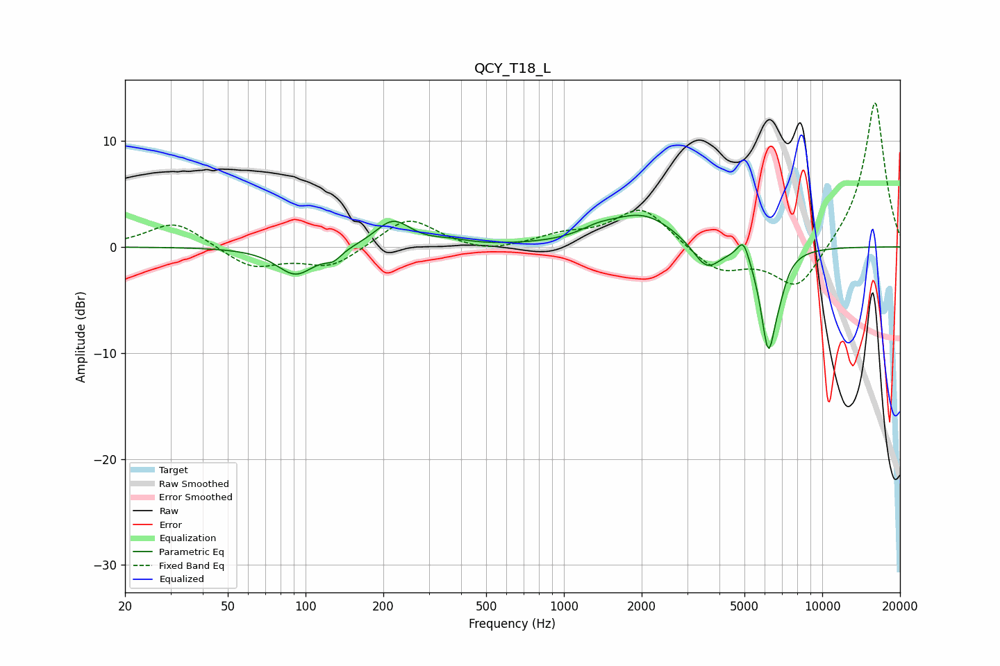

# QCY_T18_L
See [usage instructions](https://github.com/jaakkopasanen/AutoEq#usage) for more options and info.

### Parametric EQs
Apply preamp of -3.1 dB when using parametric equalizer.

|   # | Type    |   Fc (Hz) |    Q |   Gain (dB) |
|-----|---------|-----------|------|-------------|
|   1 | Peaking |        92 | 1.92 |        -2.6 |
|   2 | Peaking |       128 | 4.35 |        -0.8 |
|   3 | Peaking |       218 | 2.07 |         2.5 |
|   4 | Peaking |       363 | 2.13 |         0.4 |
|   5 | Peaking |      1354 | 2.02 |         0.7 |
|   6 | Peaking |      2024 | 1.1  |         3   |
|   7 | Peaking |      3569 | 2.6  |        -2.6 |
|   8 | Peaking |      4952 | 6    |         2   |
|   9 | Peaking |      6188 | 4.52 |        -9.3 |
|  10 | Peaking |      6863 | 5.24 |        -1.4 |

### Fixed Band EQs
When using fixed band (also called graphic) equalizer, apply preamp of **-13.7 dB** (if available) and set gains manually with these parameters.

|   # | Type    |   Fc (Hz) |    Q |   Gain (dB) |
|-----|---------|-----------|------|-------------|
|   1 | Peaking |        31 | 1.41 |         2.4 |
|   2 | Peaking |        62 | 1.41 |        -2   |
|   3 | Peaking |       125 | 1.41 |        -1.9 |
|   4 | Peaking |       250 | 1.41 |         2.9 |
|   5 | Peaking |       500 | 1.41 |        -0.7 |
|   6 | Peaking |      1000 | 1.41 |         1   |
|   7 | Peaking |      2000 | 1.41 |         3.7 |
|   8 | Peaking |      4000 | 1.41 |        -2.4 |
|   9 | Peaking |      8000 | 1.41 |        -4.2 |
|  10 | Peaking |     16000 | 1.41 |        13.9 |

### Graphs

