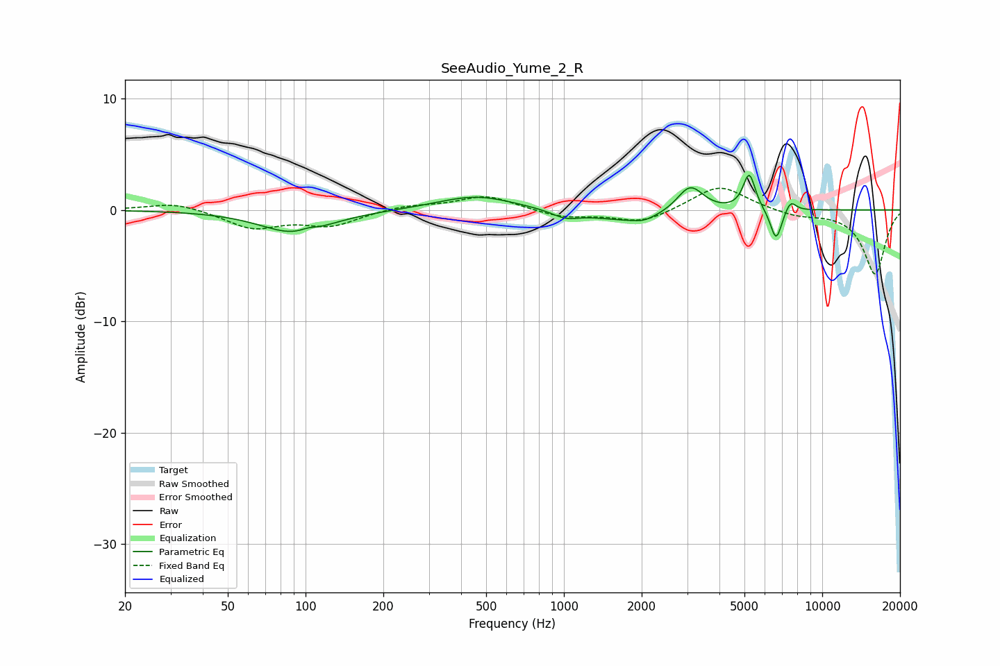

# SeeAudio_Yume_2_R
See [usage instructions](https://github.com/jaakkopasanen/AutoEq#usage) for more options and info.

### Parametric EQs
Apply preamp of -3.2 dB when using parametric equalizer.

|   # | Type    |   Fc (Hz) |    Q |   Gain (dB) |
|-----|---------|-----------|------|-------------|
|   1 | Peaking |        91 | 1.06 |        -2.1 |
|   2 | Peaking |       102 | 4.48 |         0.3 |
|   3 | Peaking |       457 | 0.96 |         1.3 |
|   4 | Peaking |      1013 | 2.66 |        -0.7 |
|   5 | Peaking |      1853 | 0.94 |        -1.1 |
|   6 | Peaking |      2044 | 3.89 |        -0.3 |
|   7 | Peaking |      3080 | 2.75 |         2.5 |
|   8 | Peaking |      5216 | 5.88 |         3.3 |
|   9 | Peaking |      6631 | 5.96 |        -2.9 |
|  10 | Peaking |      7531 | 6    |         1.1 |

### Fixed Band EQs
When using fixed band (also called graphic) equalizer, apply preamp of **-2.0 dB** (if available) and set gains manually with these parameters.

|   # | Type    |   Fc (Hz) |    Q |   Gain (dB) |
|-----|---------|-----------|------|-------------|
|   1 | Peaking |        31 | 1.41 |         0.7 |
|   2 | Peaking |        62 | 1.41 |        -1.6 |
|   3 | Peaking |       125 | 1.41 |        -1.3 |
|   4 | Peaking |       250 | 1.41 |         0.4 |
|   5 | Peaking |       500 | 1.41 |         1.3 |
|   6 | Peaking |      1000 | 1.41 |        -0.7 |
|   7 | Peaking |      2000 | 1.41 |        -1.2 |
|   8 | Peaking |      4000 | 1.41 |         2.3 |
|   9 | Peaking |      8000 | 1.41 |        -0.5 |
|  10 | Peaking |     16000 | 1.41 |        -5.8 |

### Graphs

