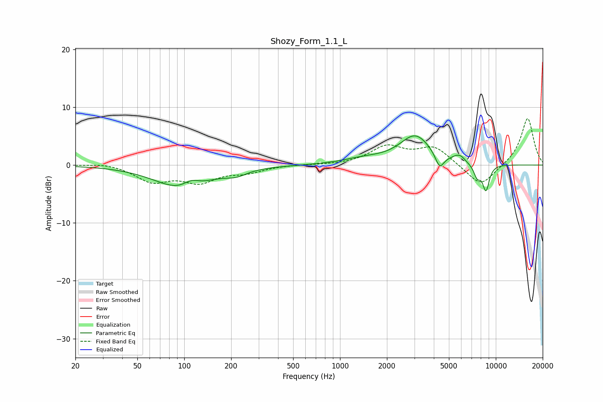

# Shozy_Form_1.1_L
See [usage instructions](https://github.com/jaakkopasanen/AutoEq#usage) for more options and info.

### Parametric EQs
Apply preamp of -5.2 dB when using parametric equalizer.

|   # | Type    |   Fc (Hz) |    Q |   Gain (dB) |
|-----|---------|-----------|------|-------------|
|   1 | Peaking |        98 | 0.82 |        -4.1 |
|   2 | Peaking |       111 | 2.71 |         1.3 |
|   3 | Peaking |       216 | 2.16 |        -0.9 |
|   4 | Peaking |      1419 | 1.04 |         0.9 |
|   5 | Peaking |      3044 | 1.4  |         5   |
|   6 | Peaking |      4359 | 4.99 |        -2.6 |
|   7 | Peaking |      5684 | 3.8  |         0.9 |
|   8 | Peaking |      6053 | 5.99 |         0.4 |
|   9 | Peaking |      7598 | 5.92 |        -2.1 |
|  10 | Peaking |      8647 | 6    |        -4.4 |

### Fixed Band EQs
When using fixed band (also called graphic) equalizer, apply preamp of **-8.1 dB** (if available) and set gains manually with these parameters.

|   # | Type    |   Fc (Hz) |    Q |   Gain (dB) |
|-----|---------|-----------|------|-------------|
|   1 | Peaking |        31 | 1.41 |         0.4 |
|   2 | Peaking |        62 | 1.41 |        -2.7 |
|   3 | Peaking |       125 | 1.41 |        -2.7 |
|   4 | Peaking |       250 | 1.41 |        -1.1 |
|   5 | Peaking |       500 | 1.41 |         0.1 |
|   6 | Peaking |      1000 | 1.41 |        -0   |
|   7 | Peaking |      2000 | 1.41 |         3.1 |
|   8 | Peaking |      4000 | 1.41 |         3   |
|   9 | Peaking |      8000 | 1.41 |        -3.9 |
|  10 | Peaking |     16000 | 1.41 |         8.2 |

### Graphs

