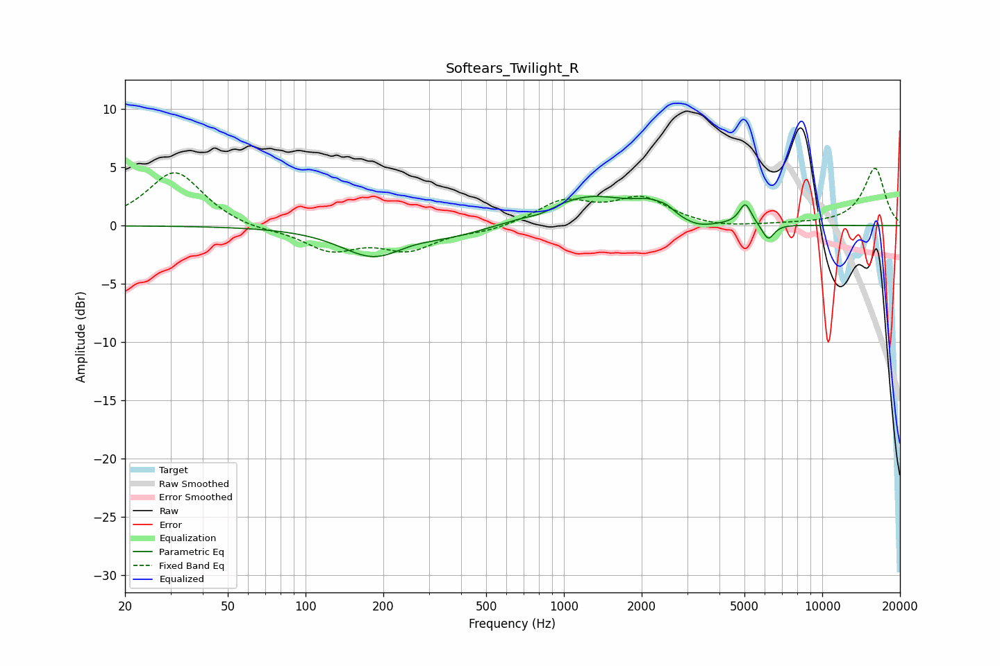

# Softears_Twilight_R
See [usage instructions](https://github.com/jaakkopasanen/AutoEq#usage) for more options and info.

### Parametric EQs
Apply preamp of -2.6 dB when using parametric equalizer.

|   # | Type    |   Fc (Hz) |    Q |   Gain (dB) |
|-----|---------|-----------|------|-------------|
|   1 | Peaking |       184 | 1.11 |        -2.6 |
|   2 | Peaking |       251 | 1.76 |         0.2 |
|   3 | Peaking |       370 | 0.89 |        -0.7 |
|   4 | Peaking |       816 | 3.06 |        -0.3 |
|   5 | Peaking |      1247 | 0.82 |         2.5 |
|   6 | Peaking |      2184 | 2.16 |         1.1 |
|   7 | Peaking |      2510 | 5.19 |         0.3 |
|   8 | Peaking |      3272 | 2.11 |        -0.7 |
|   9 | Peaking |      5039 | 6    |         1.8 |
|  10 | Peaking |      6177 | 5.97 |        -1.4 |

### Fixed Band EQs
When using fixed band (also called graphic) equalizer, apply preamp of **-5.0 dB** (if available) and set gains manually with these parameters.

|   # | Type    |   Fc (Hz) |    Q |   Gain (dB) |
|-----|---------|-----------|------|-------------|
|   1 | Peaking |        31 | 1.41 |         4.7 |
|   2 | Peaking |        62 | 1.41 |        -0.4 |
|   3 | Peaking |       125 | 1.41 |        -2   |
|   4 | Peaking |       250 | 1.41 |        -1.9 |
|   5 | Peaking |       500 | 1.41 |        -0.4 |
|   6 | Peaking |      1000 | 1.41 |         2   |
|   7 | Peaking |      2000 | 1.41 |         2.2 |
|   8 | Peaking |      4000 | 1.41 |        -0.3 |
|   9 | Peaking |      8000 | 1.41 |         0.1 |
|  10 | Peaking |     16000 | 1.41 |         4.9 |

### Graphs

