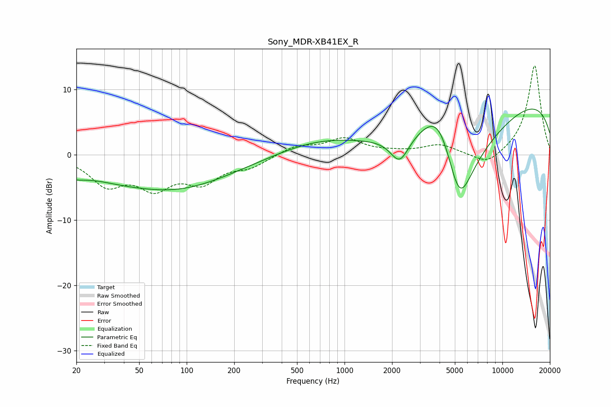

# Sony_MDR-XB41EX_R
See [usage instructions](https://github.com/jaakkopasanen/AutoEq#usage) for more options and info.

### Parametric EQs
Apply preamp of -7.1 dB when using parametric equalizer.

|   # | Type    |   Fc (Hz) |    Q |   Gain (dB) |
|-----|---------|-----------|------|-------------|
|   1 | Peaking |        20 | 0.63 |        -0.1 |
|   2 | Peaking |        26 | 1.05 |         0.8 |
|   3 | Peaking |        39 | 0.18 |        -4.6 |
|   4 | Peaking |        94 | 0.57 |        -1.3 |
|   5 | Peaking |       115 | 1.67 |         0   |
|   6 | Peaking |       693 | 0.55 |         2   |
|   7 | Peaking |      2235 | 2.41 |        -4   |
|   8 | Peaking |      3991 | 1.11 |         9.7 |
|   9 | Peaking |      5321 | 0.92 |       -20   |
|  10 | Peaking |     10000 | 0.18 |         9.8 |

### Fixed Band EQs
When using fixed band (also called graphic) equalizer, apply preamp of **-13.7 dB** (if available) and set gains manually with these parameters.

|   # | Type    |   Fc (Hz) |    Q |   Gain (dB) |
|-----|---------|-----------|------|-------------|
|   1 | Peaking |        31 | 1.41 |        -4.2 |
|   2 | Peaking |        62 | 1.41 |        -4.4 |
|   3 | Peaking |       125 | 1.41 |        -3.7 |
|   4 | Peaking |       250 | 1.41 |        -1.6 |
|   5 | Peaking |       500 | 1.41 |         1.3 |
|   6 | Peaking |      1000 | 1.41 |         2.4 |
|   7 | Peaking |      2000 | 1.41 |         0.3 |
|   8 | Peaking |      4000 | 1.41 |         1.5 |
|   9 | Peaking |      8000 | 1.41 |        -1.9 |
|  10 | Peaking |     16000 | 1.41 |        13.8 |

### Graphs

