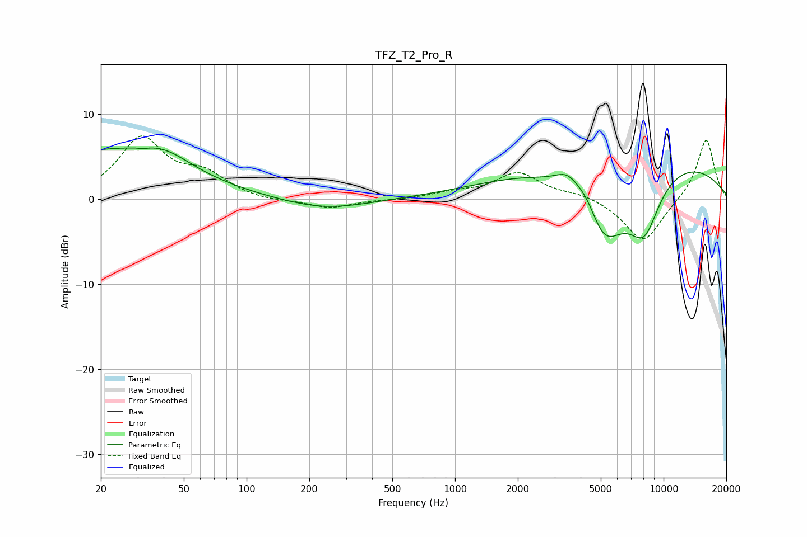

# TFZ_T2_Pro_R
See [usage instructions](https://github.com/jaakkopasanen/AutoEq#usage) for more options and info.

### Parametric EQs
Apply preamp of -6.1 dB when using parametric equalizer.

|   # | Type    |   Fc (Hz) |    Q |   Gain (dB) |
|-----|---------|-----------|------|-------------|
|   1 | Peaking |        20 | 0.37 |         5.5 |
|   2 | Peaking |        32 | 5.77 |         1.4 |
|   3 | Peaking |        32 | 5.92 |        -1.5 |
|   4 | Peaking |        40 | 1.16 |         1.8 |
|   5 | Peaking |       237 | 0.7  |        -1.3 |
|   6 | Peaking |      3465 | 2.36 |         1.9 |
|   7 | Peaking |      4339 | 2.18 |         2.8 |
|   8 | Peaking |      5084 | 1.2  |       -10   |
|   9 | Peaking |      6878 | 0.21 |         5.6 |
|  10 | Peaking |      8068 | 1.69 |        -6.6 |

### Fixed Band EQs
When using fixed band (also called graphic) equalizer, apply preamp of **-7.6 dB** (if available) and set gains manually with these parameters.

|   # | Type    |   Fc (Hz) |    Q |   Gain (dB) |
|-----|---------|-----------|------|-------------|
|   1 | Peaking |        31 | 1.41 |         7   |
|   2 | Peaking |        62 | 1.41 |         2.5 |
|   3 | Peaking |       125 | 1.41 |        -0.3 |
|   4 | Peaking |       250 | 1.41 |        -1.1 |
|   5 | Peaking |       500 | 1.41 |        -0.1 |
|   6 | Peaking |      1000 | 1.41 |         0.6 |
|   7 | Peaking |      2000 | 1.41 |         3   |
|   8 | Peaking |      4000 | 1.41 |         0.6 |
|   9 | Peaking |      8000 | 1.41 |        -5.2 |
|  10 | Peaking |     16000 | 1.41 |         7.2 |

### Graphs

