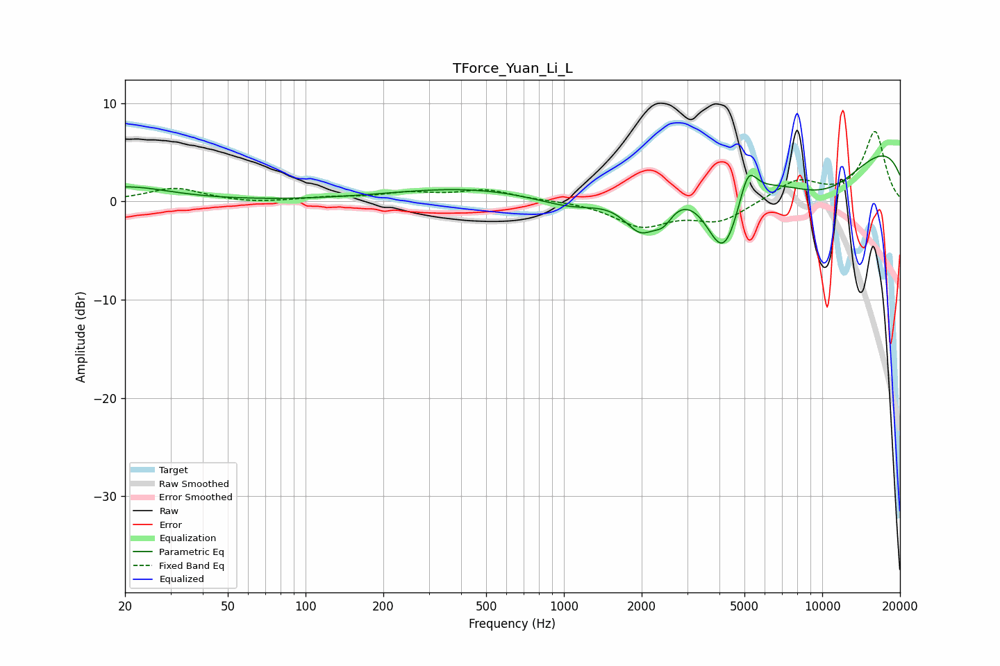

# TForce_Yuan_Li_L
See [usage instructions](https://github.com/jaakkopasanen/AutoEq#usage) for more options and info.

### Parametric EQs
Apply preamp of -4.7 dB when using parametric equalizer.

|   # | Type    |   Fc (Hz) |    Q |   Gain (dB) |
|-----|---------|-----------|------|-------------|
|   1 | Peaking |        20 | 0.84 |         1.5 |
|   2 | Peaking |       406 | 0.48 |         1.3 |
|   3 | Peaking |      1110 | 0.95 |        -1.9 |
|   4 | Peaking |      1845 | 5.98 |         0.1 |
|   5 | Peaking |      1974 | 2.09 |        -4.4 |
|   6 | Peaking |      2425 | 3.53 |        -2   |
|   7 | Peaking |      4148 | 1.84 |        -8.9 |
|   8 | Peaking |      5154 | 4    |         3.6 |
|   9 | Peaking |      9888 | 0.55 |        -7   |
|  10 | Peaking |     10000 | 0.18 |         8.7 |

### Fixed Band EQs
When using fixed band (also called graphic) equalizer, apply preamp of **-7.2 dB** (if available) and set gains manually with these parameters.

|   # | Type    |   Fc (Hz) |    Q |   Gain (dB) |
|-----|---------|-----------|------|-------------|
|   1 | Peaking |        31 | 1.41 |         1.4 |
|   2 | Peaking |        62 | 1.41 |        -0.2 |
|   3 | Peaking |       125 | 1.41 |         0.4 |
|   4 | Peaking |       250 | 1.41 |         0.8 |
|   5 | Peaking |       500 | 1.41 |         1.1 |
|   6 | Peaking |      1000 | 1.41 |         0.1 |
|   7 | Peaking |      2000 | 1.41 |        -2.4 |
|   8 | Peaking |      4000 | 1.41 |        -2   |
|   9 | Peaking |      8000 | 1.41 |         2.1 |
|  10 | Peaking |     16000 | 1.41 |         7.1 |

### Graphs

