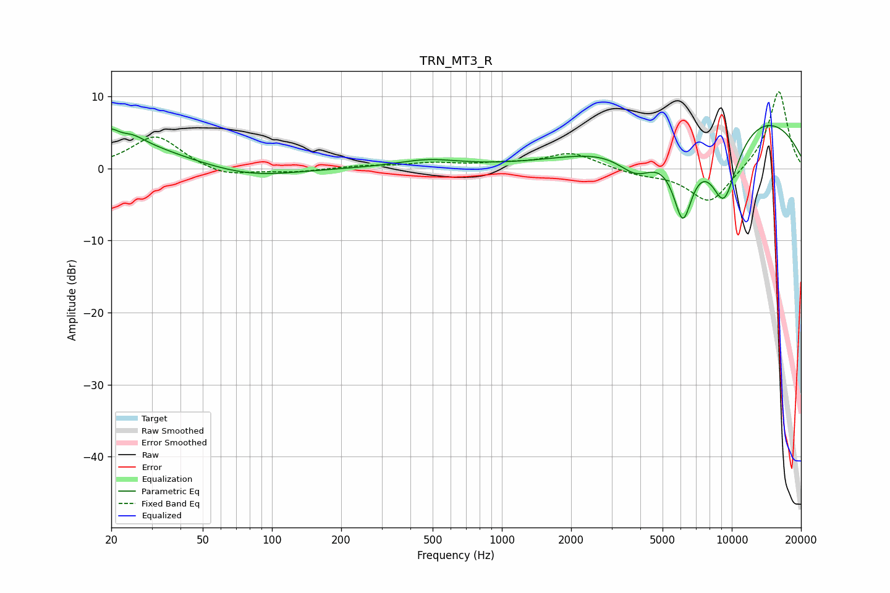

# TRN_MT3_R
See [usage instructions](https://github.com/jaakkopasanen/AutoEq#usage) for more options and info.

### Parametric EQs
Apply preamp of -6.1 dB when using parametric equalizer.

|   # | Type    |   Fc (Hz) |    Q |   Gain (dB) |
|-----|---------|-----------|------|-------------|
|   1 | Peaking |        20 | 5.04 |         3.6 |
|   2 | Peaking |        20 | 5.8  |        -1.7 |
|   3 | Peaking |        24 | 0.67 |         3.4 |
|   4 | Peaking |        25 | 2.59 |         1.1 |
|   5 | Peaking |        81 | 0.76 |        -1.3 |
|   6 | Peaking |       476 | 1.02 |         1.1 |
|   7 | Peaking |      3863 | 1.61 |        -4.3 |
|   8 | Peaking |      6125 | 2.88 |       -10.7 |
|   9 | Peaking |      9238 | 1.81 |       -11.2 |
|  10 | Peaking |     10000 | 0.27 |         8.7 |

### Fixed Band EQs
When using fixed band (also called graphic) equalizer, apply preamp of **-10.8 dB** (if available) and set gains manually with these parameters.

|   # | Type    |   Fc (Hz) |    Q |   Gain (dB) |
|-----|---------|-----------|------|-------------|
|   1 | Peaking |        31 | 1.41 |         4.6 |
|   2 | Peaking |        62 | 1.41 |        -1.2 |
|   3 | Peaking |       125 | 1.41 |        -0.5 |
|   4 | Peaking |       250 | 1.41 |         0.3 |
|   5 | Peaking |       500 | 1.41 |         0.7 |
|   6 | Peaking |      1000 | 1.41 |         0.5 |
|   7 | Peaking |      2000 | 1.41 |         2.2 |
|   8 | Peaking |      4000 | 1.41 |        -0.8 |
|   9 | Peaking |      8000 | 1.41 |        -5   |
|  10 | Peaking |     16000 | 1.41 |        11   |

### Graphs

