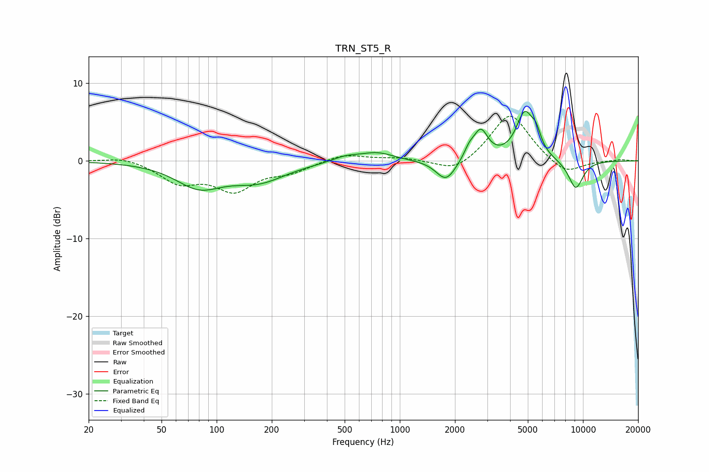

# TRN_ST5_R
See [usage instructions](https://github.com/jaakkopasanen/AutoEq#usage) for more options and info.

### Parametric EQs
Apply preamp of -6.5 dB when using parametric equalizer.

|   # | Type    |   Fc (Hz) |    Q |   Gain (dB) |
|-----|---------|-----------|------|-------------|
|   1 | Peaking |        80 | 1.11 |        -3.1 |
|   2 | Peaking |       170 | 0.94 |        -2.3 |
|   3 | Peaking |       505 | 1.9  |         0.7 |
|   4 | Peaking |       751 | 1.55 |         1.1 |
|   5 | Peaking |      1789 | 2.62 |        -2.8 |
|   6 | Peaking |      2393 | 5.12 |         1.2 |
|   7 | Peaking |      2766 | 3.56 |         3.7 |
|   8 | Peaking |      4802 | 2.93 |         5.8 |
|   9 | Peaking |      5543 | 5.05 |         2   |
|  10 | Peaking |      9134 | 3.05 |        -3.7 |

### Fixed Band EQs
When using fixed band (also called graphic) equalizer, apply preamp of **-5.8 dB** (if available) and set gains manually with these parameters.

|   # | Type    |   Fc (Hz) |    Q |   Gain (dB) |
|-----|---------|-----------|------|-------------|
|   1 | Peaking |        31 | 1.41 |         0.6 |
|   2 | Peaking |        62 | 1.41 |        -2.6 |
|   3 | Peaking |       125 | 1.41 |        -3.5 |
|   4 | Peaking |       250 | 1.41 |        -1.2 |
|   5 | Peaking |       500 | 1.41 |         0.9 |
|   6 | Peaking |      1000 | 1.41 |         0.4 |
|   7 | Peaking |      2000 | 1.41 |        -1.7 |
|   8 | Peaking |      4000 | 1.41 |         6.3 |
|   9 | Peaking |      8000 | 1.41 |        -1.9 |
|  10 | Peaking |     16000 | 1.41 |         0.2 |

### Graphs

