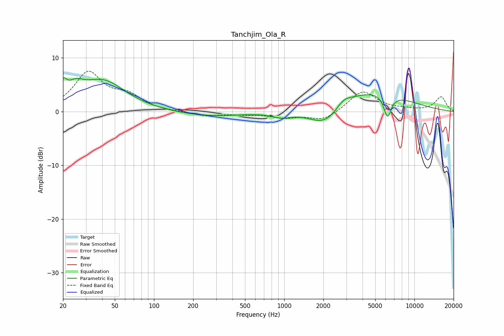

# Tanchjim_Ola_R
See [usage instructions](https://github.com/jaakkopasanen/AutoEq#usage) for more options and info.

### Parametric EQs
Apply preamp of -6.4 dB when using parametric equalizer.

|   # | Type    |   Fc (Hz) |    Q |   Gain (dB) |
|-----|---------|-----------|------|-------------|
|   1 | Peaking |        20 | 5.76 |         2.6 |
|   2 | Peaking |        25 | 2.14 |         2.5 |
|   3 | Peaking |        41 | 0.82 |         5.5 |
|   4 | Peaking |       266 | 0.58 |        -0.9 |
|   5 | Peaking |       464 | 5.98 |         0   |
|   6 | Peaking |       953 | 1.98 |        -0.9 |
|   7 | Peaking |      2075 | 1.12 |        -3.8 |
|   8 | Peaking |      2868 | 2.44 |         1.4 |
|   9 | Peaking |      4597 | 0.51 |         4   |
|  10 | Peaking |      6221 | 4.68 |        -4.2 |

### Fixed Band EQs
When using fixed band (also called graphic) equalizer, apply preamp of **-7.6 dB** (if available) and set gains manually with these parameters.

|   # | Type    |   Fc (Hz) |    Q |   Gain (dB) |
|-----|---------|-----------|------|-------------|
|   1 | Peaking |        31 | 1.41 |         7   |
|   2 | Peaking |        62 | 1.41 |         2.5 |
|   3 | Peaking |       125 | 1.41 |        -0   |
|   4 | Peaking |       250 | 1.41 |        -0.8 |
|   5 | Peaking |       500 | 1.41 |        -0.4 |
|   6 | Peaking |      1000 | 1.41 |        -1   |
|   7 | Peaking |      2000 | 1.41 |        -1.7 |
|   8 | Peaking |      4000 | 1.41 |         3.9 |
|   9 | Peaking |      8000 | 1.41 |         0.3 |
|  10 | Peaking |     16000 | 1.41 |         2.7 |

### Graphs

