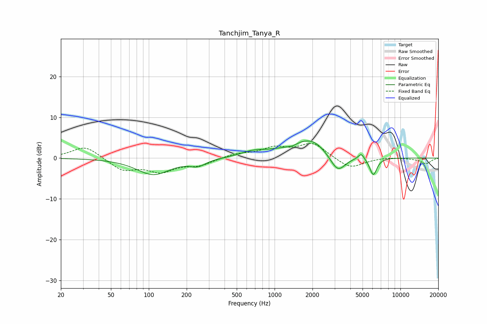

# Tanchjim_Tanya_R
See [usage instructions](https://github.com/jaakkopasanen/AutoEq#usage) for more options and info.

### Parametric EQs
Apply preamp of -4.3 dB when using parametric equalizer.

|   # | Type    |   Fc (Hz) |    Q |   Gain (dB) |
|-----|---------|-----------|------|-------------|
|   1 | Peaking |       108 | 1.08 |        -4   |
|   2 | Peaking |       245 | 2.21 |        -1.5 |
|   3 | Peaking |       668 | 1.51 |         1.1 |
|   4 | Peaking |      1200 | 2.04 |        -0.3 |
|   5 | Peaking |      1395 | 3.25 |        -0.8 |
|   6 | Peaking |      1716 | 0.81 |         4.5 |
|   7 | Peaking |      2095 | 2.04 |         0.8 |
|   8 | Peaking |      3175 | 2.22 |        -4.7 |
|   9 | Peaking |      4884 | 6    |         1.5 |
|  10 | Peaking |      6088 | 4.8  |        -4.3 |

### Fixed Band EQs
When using fixed band (also called graphic) equalizer, apply preamp of **-3.7 dB** (if available) and set gains manually with these parameters.

|   # | Type    |   Fc (Hz) |    Q |   Gain (dB) |
|-----|---------|-----------|------|-------------|
|   1 | Peaking |        31 | 1.41 |         3.1 |
|   2 | Peaking |        62 | 1.41 |        -2.9 |
|   3 | Peaking |       125 | 1.41 |        -3   |
|   4 | Peaking |       250 | 1.41 |        -1.6 |
|   5 | Peaking |       500 | 1.41 |         1   |
|   6 | Peaking |      1000 | 1.41 |         2.3 |
|   7 | Peaking |      2000 | 1.41 |         3.6 |
|   8 | Peaking |      4000 | 1.41 |        -2.7 |
|   9 | Peaking |      8000 | 1.41 |         0.3 |
|  10 | Peaking |     16000 | 1.41 |        -1.3 |

### Graphs

