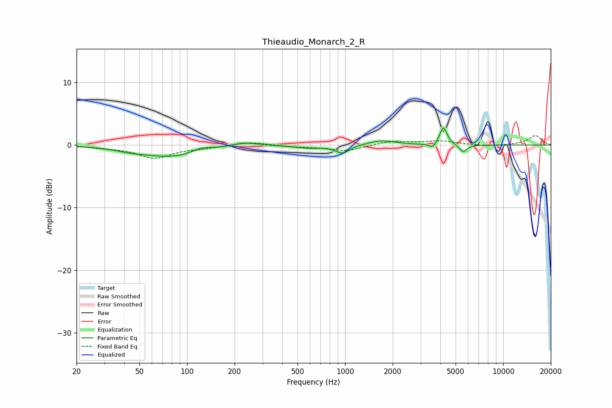

# Thieaudio_Monarch_2_R
See [usage instructions](https://github.com/jaakkopasanen/AutoEq#usage) for more options and info.

### Parametric EQs
Apply preamp of -2.8 dB when using parametric equalizer.

|   # | Type    |   Fc (Hz) |    Q |   Gain (dB) |
|-----|---------|-----------|------|-------------|
|   1 | Peaking |        45 | 1.36 |        -0.5 |
|   2 | Peaking |        81 | 0.84 |        -1.7 |
|   3 | Peaking |       123 | 2.4  |         0.6 |
|   4 | Peaking |       232 | 1.82 |         0.6 |
|   5 | Peaking |       591 | 1.67 |        -0.4 |
|   6 | Peaking |       962 | 3.27 |        -1.3 |
|   7 | Peaking |      1713 | 1.67 |         0.7 |
|   8 | Peaking |      3592 | 6    |        -0.8 |
|   9 | Peaking |      4182 | 5.99 |         2.9 |
|  10 | Peaking |      5582 | 5.83 |        -1.2 |

### Fixed Band EQs
When using fixed band (also called graphic) equalizer, apply preamp of **-1.6 dB** (if available) and set gains manually with these parameters.

|   # | Type    |   Fc (Hz) |    Q |   Gain (dB) |
|-----|---------|-----------|------|-------------|
|   1 | Peaking |        31 | 1.41 |        -0.3 |
|   2 | Peaking |        62 | 1.41 |        -2   |
|   3 | Peaking |       125 | 1.41 |        -0.4 |
|   4 | Peaking |       250 | 1.41 |         0.5 |
|   5 | Peaking |       500 | 1.41 |        -0.2 |
|   6 | Peaking |      1000 | 1.41 |        -1   |
|   7 | Peaking |      2000 | 1.41 |         0.6 |
|   8 | Peaking |      4000 | 1.41 |         0.6 |
|   9 | Peaking |      8000 | 1.41 |        -0.2 |
|  10 | Peaking |     16000 | 1.41 |         1.5 |

### Graphs

