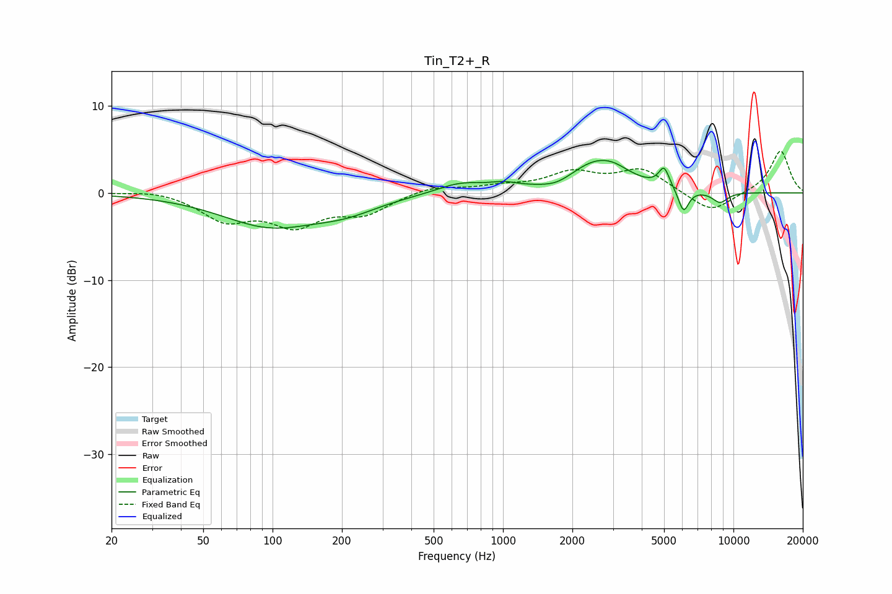

# Tin_T2+_R
See [usage instructions](https://github.com/jaakkopasanen/AutoEq#usage) for more options and info.

### Parametric EQs
Apply preamp of -3.8 dB when using parametric equalizer.

|   # | Type    |   Fc (Hz) |    Q |   Gain (dB) |
|-----|---------|-----------|------|-------------|
|   1 | Peaking |        97 | 0.67 |        -3.6 |
|   2 | Peaking |       209 | 0.98 |        -1.4 |
|   3 | Peaking |       654 | 1.36 |         1.2 |
|   4 | Peaking |      1009 | 2.28 |         0.6 |
|   5 | Peaking |      1716 | 2    |        -0.8 |
|   6 | Peaking |      2563 | 1.13 |         3.6 |
|   7 | Peaking |      3052 | 2.44 |         0.5 |
|   8 | Peaking |      5002 | 6    |         2.3 |
|   9 | Peaking |      6073 | 5.99 |        -2.7 |
|  10 | Peaking |      8747 | 3.7  |        -1.2 |

### Fixed Band EQs
When using fixed band (also called graphic) equalizer, apply preamp of **-4.9 dB** (if available) and set gains manually with these parameters.

|   # | Type    |   Fc (Hz) |    Q |   Gain (dB) |
|-----|---------|-----------|------|-------------|
|   1 | Peaking |        31 | 1.41 |         0.4 |
|   2 | Peaking |        62 | 1.41 |        -2.9 |
|   3 | Peaking |       125 | 1.41 |        -3.4 |
|   4 | Peaking |       250 | 1.41 |        -2.2 |
|   5 | Peaking |       500 | 1.41 |         0.8 |
|   6 | Peaking |      1000 | 1.41 |         0.6 |
|   7 | Peaking |      2000 | 1.41 |         2.1 |
|   8 | Peaking |      4000 | 1.41 |         2.6 |
|   9 | Peaking |      8000 | 1.41 |        -2.4 |
|  10 | Peaking |     16000 | 1.41 |         4.9 |

### Graphs

