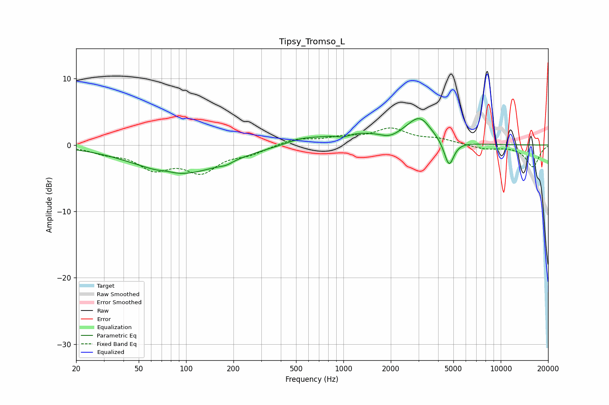

# Tipsy_Tromso_L
See [usage instructions](https://github.com/jaakkopasanen/AutoEq#usage) for more options and info.

### Parametric EQs
Apply preamp of -4.1 dB when using parametric equalizer.

|   # | Type    |   Fc (Hz) |    Q |   Gain (dB) |
|-----|---------|-----------|------|-------------|
|   1 | Peaking |        76 | 3.48 |         0.2 |
|   2 | Peaking |        91 | 0.51 |        -4.4 |
|   3 | Peaking |       180 | 3.41 |        -0.4 |
|   4 | Peaking |       539 | 1.41 |         0.7 |
|   5 | Peaking |      1003 | 3.43 |        -0.5 |
|   6 | Peaking |      1232 | 0.66 |         1.8 |
|   7 | Peaking |      1962 | 2.42 |        -0.7 |
|   8 | Peaking |      2881 | 3.33 |        -0.3 |
|   9 | Peaking |      3013 | 1.89 |         4   |
|  10 | Peaking |      4691 | 4.57 |        -3.9 |

### Fixed Band EQs
When using fixed band (also called graphic) equalizer, apply preamp of **-2.7 dB** (if available) and set gains manually with these parameters.

|   # | Type    |   Fc (Hz) |    Q |   Gain (dB) |
|-----|---------|-----------|------|-------------|
|   1 | Peaking |        31 | 1.41 |        -1   |
|   2 | Peaking |        62 | 1.41 |        -3.2 |
|   3 | Peaking |       125 | 1.41 |        -3.6 |
|   4 | Peaking |       250 | 1.41 |        -1.1 |
|   5 | Peaking |       500 | 1.41 |         0.9 |
|   6 | Peaking |      1000 | 1.41 |         1   |
|   7 | Peaking |      2000 | 1.41 |         2.3 |
|   8 | Peaking |      4000 | 1.41 |         0.8 |
|   9 | Peaking |      8000 | 1.41 |        -0.6 |
|  10 | Peaking |     16000 | 1.41 |        -3.3 |

### Graphs

