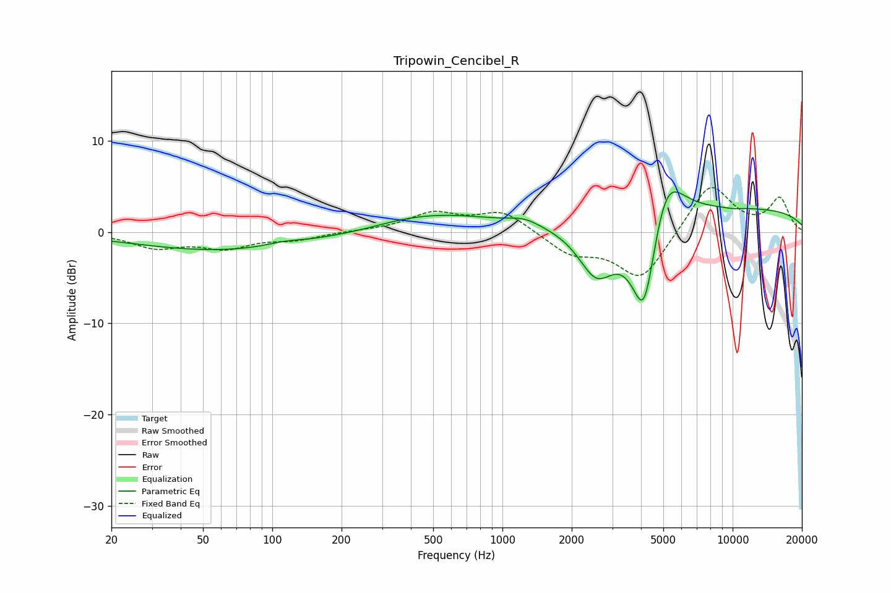

# Tripowin_Cencibel_R
See [usage instructions](https://github.com/jaakkopasanen/AutoEq#usage) for more options and info.

### Parametric EQs
Apply preamp of -4.5 dB when using parametric equalizer.

|   # | Type    |   Fc (Hz) |    Q |   Gain (dB) |
|-----|---------|-----------|------|-------------|
|   1 | Peaking |        66 | 0.34 |        -2.1 |
|   2 | Peaking |       112 | 1.82 |         0.4 |
|   3 | Peaking |       244 | 0.84 |        -0.6 |
|   4 | Peaking |       443 | 0.44 |         2.3 |
|   5 | Peaking |      1247 | 2.15 |         0.7 |
|   6 | Peaking |      2561 | 1.76 |        -5.5 |
|   7 | Peaking |      4127 | 2.29 |       -12.4 |
|   8 | Peaking |      5100 | 1.79 |         7.4 |
|   9 | Peaking |      9997 | 0.2  |         2.6 |
|  10 | Peaking |     10000 | 3.73 |        -0.1 |

### Fixed Band EQs
When using fixed band (also called graphic) equalizer, apply preamp of **-5.0 dB** (if available) and set gains manually with these parameters.

|   # | Type    |   Fc (Hz) |    Q |   Gain (dB) |
|-----|---------|-----------|------|-------------|
|   1 | Peaking |        31 | 1.41 |        -1.6 |
|   2 | Peaking |        62 | 1.41 |        -1.6 |
|   3 | Peaking |       125 | 1.41 |        -0.7 |
|   4 | Peaking |       250 | 1.41 |         0.1 |
|   5 | Peaking |       500 | 1.41 |         2   |
|   6 | Peaking |      1000 | 1.41 |         2.3 |
|   7 | Peaking |      2000 | 1.41 |        -2.3 |
|   8 | Peaking |      4000 | 1.41 |        -5.3 |
|   9 | Peaking |      8000 | 1.41 |         5.5 |
|  10 | Peaking |     16000 | 1.41 |         3.6 |

### Graphs

