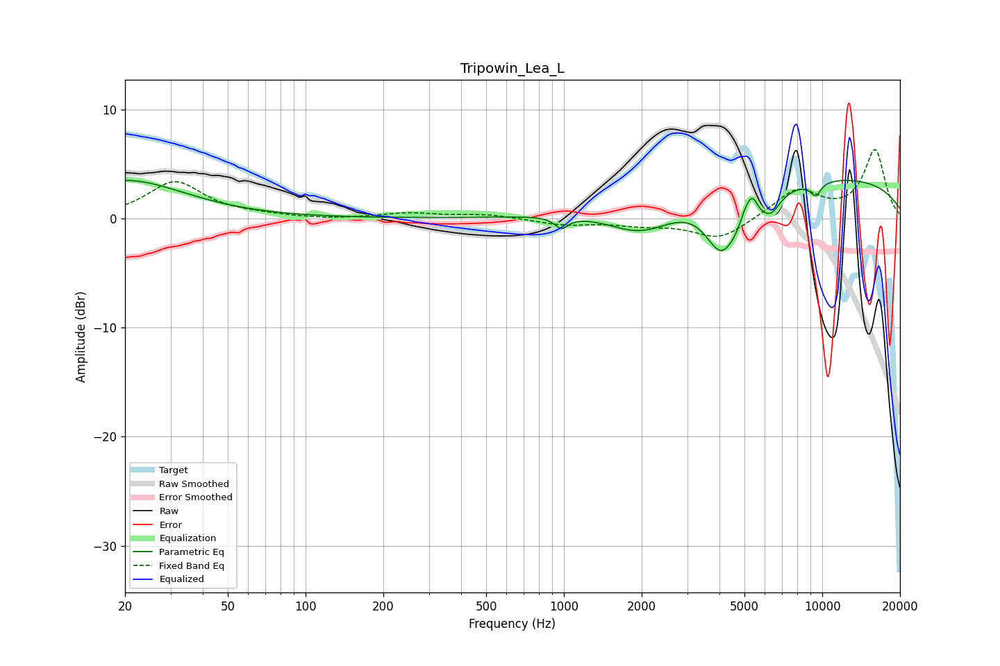

# Tripowin_Lea_L
See [usage instructions](https://github.com/jaakkopasanen/AutoEq#usage) for more options and info.

### Parametric EQs
Apply preamp of -3.6 dB when using parametric equalizer.

|   # | Type    |   Fc (Hz) |    Q |   Gain (dB) |
|-----|---------|-----------|------|-------------|
|   1 | Peaking |        20 | 0.62 |         3.5 |
|   2 | Peaking |       978 | 5.64 |        -1   |
|   3 | Peaking |      2004 | 1.04 |        -3   |
|   4 | Peaking |      4053 | 2.3  |        -4.4 |
|   5 | Peaking |      5036 | 5.94 |         1.5 |
|   6 | Peaking |      5261 | 1.78 |        -3.1 |
|   7 | Peaking |      5374 | 5.97 |         2.4 |
|   8 | Peaking |      6392 | 4.62 |        -1   |
|   9 | Peaking |      8251 | 0.18 |         3.9 |
|  10 | Peaking |      9435 | 5.79 |        -1.2 |

### Fixed Band EQs
When using fixed band (also called graphic) equalizer, apply preamp of **-6.4 dB** (if available) and set gains manually with these parameters.

|   # | Type    |   Fc (Hz) |    Q |   Gain (dB) |
|-----|---------|-----------|------|-------------|
|   1 | Peaking |        31 | 1.41 |         3.3 |
|   2 | Peaking |        62 | 1.41 |         0.2 |
|   3 | Peaking |       125 | 1.41 |        -0.1 |
|   4 | Peaking |       250 | 1.41 |         0.5 |
|   5 | Peaking |       500 | 1.41 |         0.4 |
|   6 | Peaking |      1000 | 1.41 |        -0.6 |
|   7 | Peaking |      2000 | 1.41 |        -0.5 |
|   8 | Peaking |      4000 | 1.41 |        -1.9 |
|   9 | Peaking |      8000 | 1.41 |         2.6 |
|  10 | Peaking |     16000 | 1.41 |         6.2 |

### Graphs

