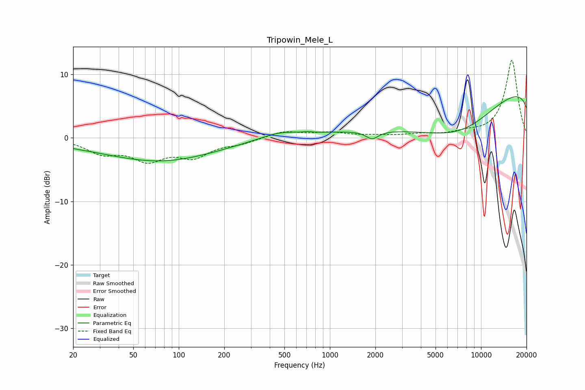

# Tripowin_Mele_L
See [usage instructions](https://github.com/jaakkopasanen/AutoEq#usage) for more options and info.

### Parametric EQs
Apply preamp of -6.6 dB when using parametric equalizer.

|   # | Type    |   Fc (Hz) |    Q |   Gain (dB) |
|-----|---------|-----------|------|-------------|
|   1 | Peaking |        21 | 1.93 |        -0.2 |
|   2 | Peaking |        69 | 0.35 |        -3.3 |
|   3 | Peaking |       100 | 0.73 |        -0.9 |
|   4 | Peaking |       105 | 0.9  |         0.5 |
|   5 | Peaking |       464 | 1.09 |         1   |
|   6 | Peaking |       716 | 4.53 |         0.2 |
|   7 | Peaking |      1416 | 3.98 |        -0   |
|   8 | Peaking |      1904 | 3.44 |        -1.3 |
|   9 | Peaking |      7488 | 0.28 |       -15.6 |
|  10 | Peaking |     10000 | 0.18 |        17.5 |

### Fixed Band EQs
When using fixed band (also called graphic) equalizer, apply preamp of **-12.3 dB** (if available) and set gains manually with these parameters.

|   # | Type    |   Fc (Hz) |    Q |   Gain (dB) |
|-----|---------|-----------|------|-------------|
|   1 | Peaking |        31 | 1.41 |        -2.2 |
|   2 | Peaking |        62 | 1.41 |        -3.1 |
|   3 | Peaking |       125 | 1.41 |        -2.7 |
|   4 | Peaking |       250 | 1.41 |        -0.7 |
|   5 | Peaking |       500 | 1.41 |         1   |
|   6 | Peaking |      1000 | 1.41 |         0.7 |
|   7 | Peaking |      2000 | 1.41 |         0.3 |
|   8 | Peaking |      4000 | 1.41 |         0.5 |
|   9 | Peaking |      8000 | 1.41 |         0.6 |
|  10 | Peaking |     16000 | 1.41 |        12.3 |

### Graphs

