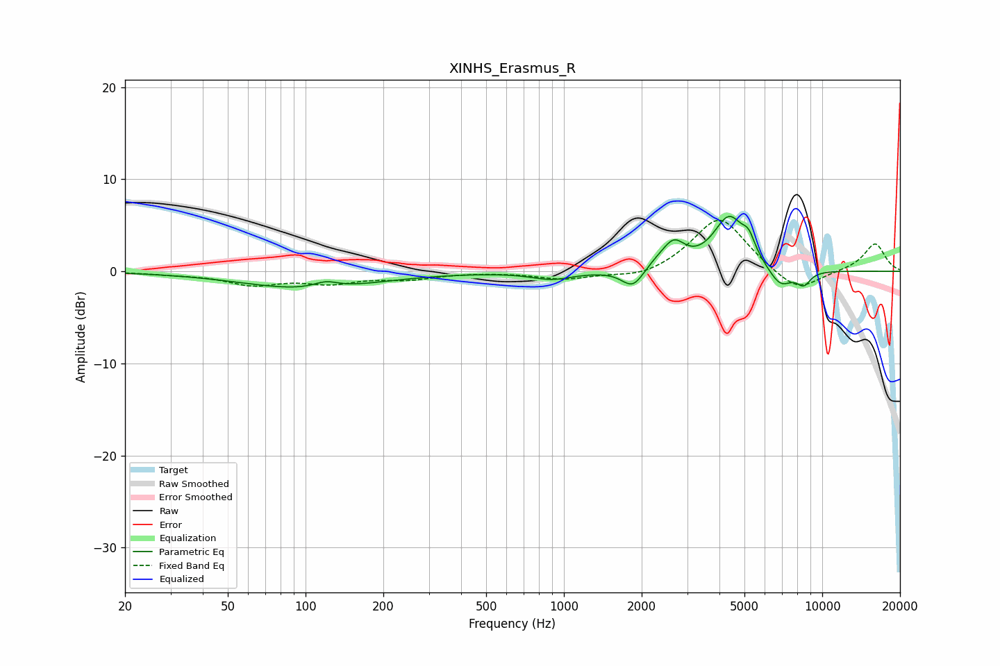

# XINHS_Erasmus_R
See [usage instructions](https://github.com/jaakkopasanen/AutoEq#usage) for more options and info.

### Parametric EQs
Apply preamp of -6.1 dB when using parametric equalizer.

|   # | Type    |   Fc (Hz) |    Q |   Gain (dB) |
|-----|---------|-----------|------|-------------|
|   1 | Peaking |       103 | 0.56 |        -1.9 |
|   2 | Peaking |       120 | 2.98 |         0.7 |
|   3 | Peaking |       902 | 1.75 |        -0.8 |
|   4 | Peaking |      1852 | 3.3  |        -2.1 |
|   5 | Peaking |      2304 | 2.65 |         0.7 |
|   6 | Peaking |      2667 | 3.28 |         2.5 |
|   7 | Peaking |      4363 | 2.26 |         5.7 |
|   8 | Peaking |      5195 | 5.68 |         1.7 |
|   9 | Peaking |      6881 | 2.92 |        -2.1 |
|  10 | Peaking |      8478 | 4.91 |        -1.4 |

### Fixed Band EQs
When using fixed band (also called graphic) equalizer, apply preamp of **-5.6 dB** (if available) and set gains manually with these parameters.

|   # | Type    |   Fc (Hz) |    Q |   Gain (dB) |
|-----|---------|-----------|------|-------------|
|   1 | Peaking |        31 | 1.41 |        -0.2 |
|   2 | Peaking |        62 | 1.41 |        -1.3 |
|   3 | Peaking |       125 | 1.41 |        -1.1 |
|   4 | Peaking |       250 | 1.41 |        -0.7 |
|   5 | Peaking |       500 | 1.41 |        -0   |
|   6 | Peaking |      1000 | 1.41 |        -0.8 |
|   7 | Peaking |      2000 | 1.41 |        -0.9 |
|   8 | Peaking |      4000 | 1.41 |         6   |
|   9 | Peaking |      8000 | 1.41 |        -2.5 |
|  10 | Peaking |     16000 | 1.41 |         3   |

### Graphs

