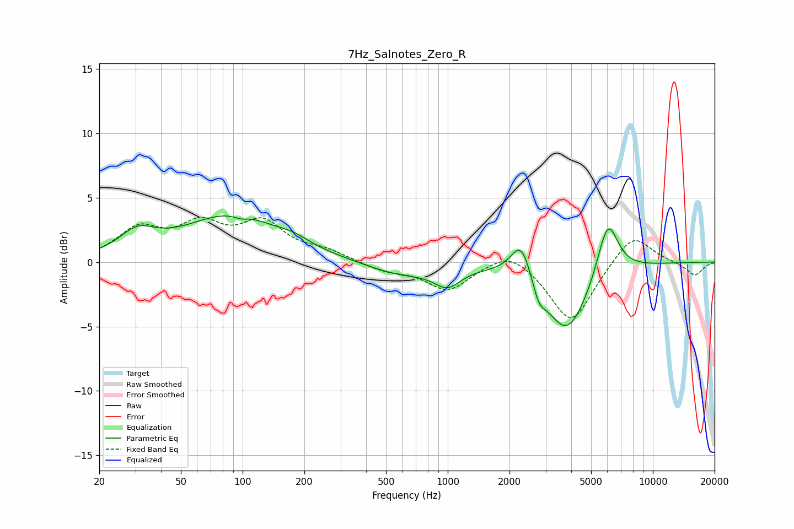

# 7Hz_Salnotes_Zero_R
See [usage instructions](https://github.com/jaakkopasanen/AutoEq#usage) for more options and info.

### Parametric EQs
Apply preamp of -3.7 dB when using parametric equalizer.

|   # | Type    |   Fc (Hz) |    Q |   Gain (dB) |
|-----|---------|-----------|------|-------------|
|   1 | Peaking |        31 | 1.63 |         1.7 |
|   2 | Peaking |        89 | 0.59 |         3.6 |
|   3 | Peaking |        98 | 4.4  |        -0.3 |
|   4 | Peaking |       178 | 1.99 |         0.4 |
|   5 | Peaking |       580 | 0.86 |        -1   |
|   6 | Peaking |       996 | 2.17 |        -1.5 |
|   7 | Peaking |      2285 | 2.76 |         3   |
|   8 | Peaking |      2777 | 4.47 |        -1.4 |
|   9 | Peaking |      3808 | 1.3  |        -5.5 |
|  10 | Peaking |      6027 | 2.69 |         4.5 |

### Fixed Band EQs
When using fixed band (also called graphic) equalizer, apply preamp of **-3.6 dB** (if available) and set gains manually with these parameters.

|   # | Type    |   Fc (Hz) |    Q |   Gain (dB) |
|-----|---------|-----------|------|-------------|
|   1 | Peaking |        31 | 1.41 |         2.4 |
|   2 | Peaking |        62 | 1.41 |         2.5 |
|   3 | Peaking |       125 | 1.41 |         2.8 |
|   4 | Peaking |       250 | 1.41 |         0.7 |
|   5 | Peaking |       500 | 1.41 |        -0.6 |
|   6 | Peaking |      1000 | 1.41 |        -2.1 |
|   7 | Peaking |      2000 | 1.41 |         1.2 |
|   8 | Peaking |      4000 | 1.41 |        -4.8 |
|   9 | Peaking |      8000 | 1.41 |         2.4 |
|  10 | Peaking |     16000 | 1.41 |        -1.1 |

### Graphs

