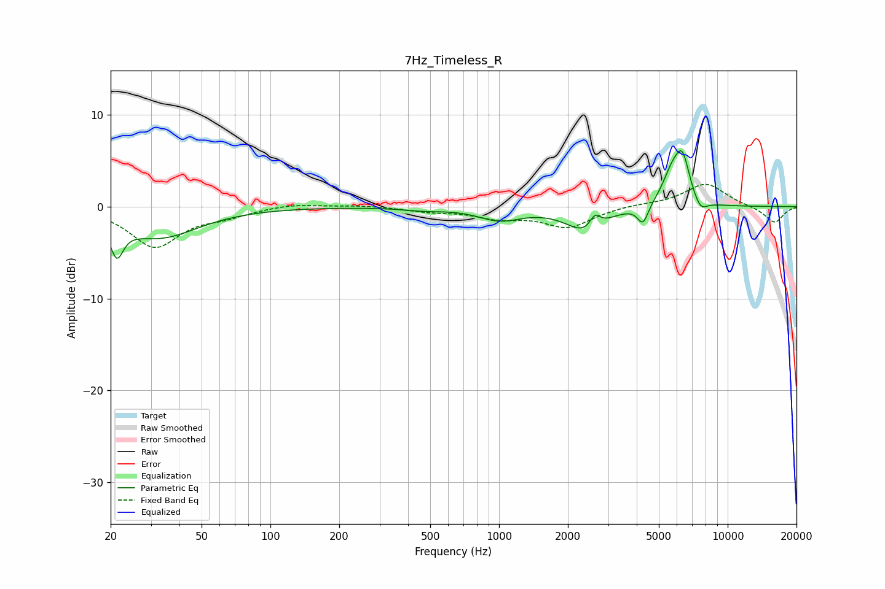

# 7Hz_Timeless_R
See [usage instructions](https://github.com/jaakkopasanen/AutoEq#usage) for more options and info.

### Parametric EQs
Apply preamp of -6.2 dB when using parametric equalizer.

|   # | Type    |   Fc (Hz) |    Q |   Gain (dB) |
|-----|---------|-----------|------|-------------|
|   1 | Peaking |        21 | 5.08 |        -3.5 |
|   2 | Peaking |        33 | 0.83 |        -3.3 |
|   3 | Peaking |       462 | 1.64 |        -0.3 |
|   4 | Peaking |      1006 | 1.51 |        -1.3 |
|   5 | Peaking |      2401 | 1.69 |        -2.7 |
|   6 | Peaking |      2627 | 6    |         1.5 |
|   7 | Peaking |      4262 | 6    |        -2.1 |
|   8 | Peaking |      5715 | 3.12 |         3.2 |
|   9 | Peaking |      6346 | 4.27 |         4.4 |
|  10 | Peaking |      7600 | 4.45 |        -1.3 |

### Fixed Band EQs
When using fixed band (also called graphic) equalizer, apply preamp of **-2.5 dB** (if available) and set gains manually with these parameters.

|   # | Type    |   Fc (Hz) |    Q |   Gain (dB) |
|-----|---------|-----------|------|-------------|
|   1 | Peaking |        31 | 1.41 |        -4.3 |
|   2 | Peaking |        62 | 1.41 |        -0.8 |
|   3 | Peaking |       125 | 1.41 |         0.4 |
|   4 | Peaking |       250 | 1.41 |         0.2 |
|   5 | Peaking |       500 | 1.41 |        -0.4 |
|   6 | Peaking |      1000 | 1.41 |        -1.1 |
|   7 | Peaking |      2000 | 1.41 |        -2.2 |
|   8 | Peaking |      4000 | 1.41 |         0.2 |
|   9 | Peaking |      8000 | 1.41 |         2.5 |
|  10 | Peaking |     16000 | 1.41 |        -1.8 |

### Graphs

