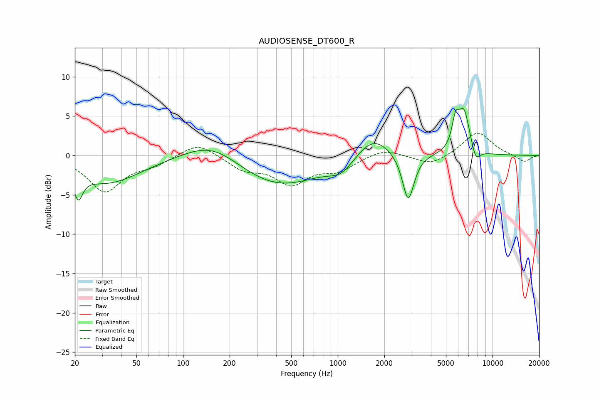

# AUDIOSENSE_DT600_R
See [usage instructions](https://github.com/jaakkopasanen/AutoEq#usage) for more options and info.

### Parametric EQs
Apply preamp of -6.1 dB when using parametric equalizer.

|   # | Type    |   Fc (Hz) |    Q |   Gain (dB) |
|-----|---------|-----------|------|-------------|
|   1 | Peaking |        21 | 5.06 |        -3.1 |
|   2 | Peaking |        32 | 0.64 |        -3.5 |
|   3 | Peaking |       155 | 0.78 |         2.6 |
|   4 | Peaking |       408 | 0.52 |        -4.1 |
|   5 | Peaking |      1052 | 1.8  |        -1.6 |
|   6 | Peaking |      1692 | 1.28 |         3   |
|   7 | Peaking |      2854 | 3.74 |        -6.1 |
|   8 | Peaking |      5777 | 5.87 |         3.3 |
|   9 | Peaking |      6546 | 3.58 |         5.4 |
|  10 | Peaking |      7790 | 4.66 |        -1.8 |

### Fixed Band EQs
When using fixed band (also called graphic) equalizer, apply preamp of **-2.9 dB** (if available) and set gains manually with these parameters.

|   # | Type    |   Fc (Hz) |    Q |   Gain (dB) |
|-----|---------|-----------|------|-------------|
|   1 | Peaking |        31 | 1.41 |        -4.5 |
|   2 | Peaking |        62 | 1.41 |        -1.1 |
|   3 | Peaking |       125 | 1.41 |         1.8 |
|   4 | Peaking |       250 | 1.41 |        -1.6 |
|   5 | Peaking |       500 | 1.41 |        -3.4 |
|   6 | Peaking |      1000 | 1.41 |        -1.7 |
|   7 | Peaking |      2000 | 1.41 |         1   |
|   8 | Peaking |      4000 | 1.41 |        -1.3 |
|   9 | Peaking |      8000 | 1.41 |         3   |
|  10 | Peaking |     16000 | 1.41 |        -0.9 |

### Graphs

