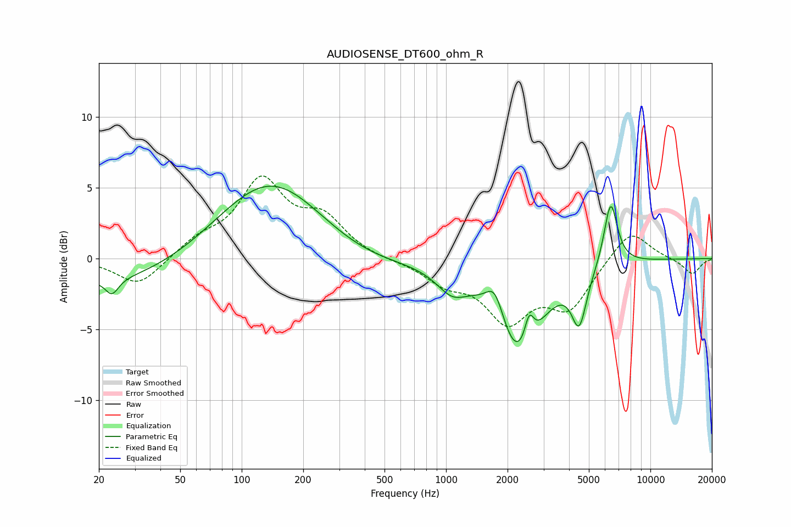

# AUDIOSENSE_DT600_ohm_R
See [usage instructions](https://github.com/jaakkopasanen/AutoEq#usage) for more options and info.

### Parametric EQs
Apply preamp of -5.2 dB when using parametric equalizer.

|   # | Type    |   Fc (Hz) |    Q |   Gain (dB) |
|-----|---------|-----------|------|-------------|
|   1 | Peaking |        23 | 4.5  |        -1.1 |
|   2 | Peaking |        25 | 0.36 |        -2   |
|   3 | Peaking |       139 | 0.53 |         6   |
|   4 | Peaking |       366 | 0.57 |        -1.1 |
|   5 | Peaking |      1068 | 1.87 |        -1.6 |
|   6 | Peaking |      1735 | 3.24 |         2.2 |
|   7 | Peaking |      2275 | 1.27 |        -6.8 |
|   8 | Peaking |      2551 | 6    |         2.1 |
|   9 | Peaking |      4484 | 3.82 |        -3.7 |
|  10 | Peaking |      6391 | 4.14 |         4.6 |

### Fixed Band EQs
When using fixed band (also called graphic) equalizer, apply preamp of **-5.9 dB** (if available) and set gains manually with these parameters.

|   # | Type    |   Fc (Hz) |    Q |   Gain (dB) |
|-----|---------|-----------|------|-------------|
|   1 | Peaking |        31 | 1.41 |        -2   |
|   2 | Peaking |        62 | 1.41 |         1.1 |
|   3 | Peaking |       125 | 1.41 |         5.3 |
|   4 | Peaking |       250 | 1.41 |         2.5 |
|   5 | Peaking |       500 | 1.41 |        -0.1 |
|   6 | Peaking |      1000 | 1.41 |        -1.5 |
|   7 | Peaking |      2000 | 1.41 |        -4.1 |
|   8 | Peaking |      4000 | 1.41 |        -3.2 |
|   9 | Peaking |      8000 | 1.41 |         2.2 |
|  10 | Peaking |     16000 | 1.41 |        -1.1 |

### Graphs

