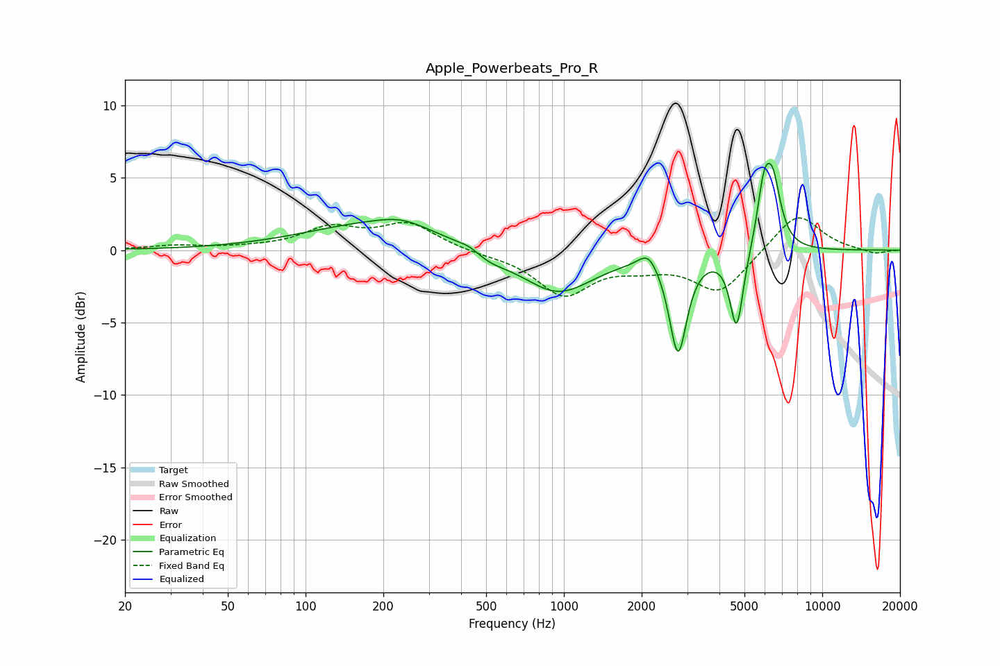

# Apple_Powerbeats_Pro_R
See [usage instructions](https://github.com/jaakkopasanen/AutoEq#usage) for more options and info.

### Parametric EQs
Apply preamp of -6.1 dB when using parametric equalizer.

|   # | Type    |   Fc (Hz) |    Q |   Gain (dB) |
|-----|---------|-----------|------|-------------|
|   1 | Peaking |       199 | 0.5  |         1.9 |
|   2 | Peaking |       235 | 1.62 |         0.5 |
|   3 | Peaking |       435 | 2.95 |         0.5 |
|   4 | Peaking |       491 | 1.67 |        -0.9 |
|   5 | Peaking |       945 | 1.01 |        -3   |
|   6 | Peaking |      2125 | 3.72 |         1.2 |
|   7 | Peaking |      2766 | 4.2  |        -6.8 |
|   8 | Peaking |      4663 | 5.46 |        -5.5 |
|   9 | Peaking |      5939 | 5.35 |         3.6 |
|  10 | Peaking |      6435 | 4.43 |         4.3 |

### Fixed Band EQs
When using fixed band (also called graphic) equalizer, apply preamp of **-2.3 dB** (if available) and set gains manually with these parameters.

|   # | Type    |   Fc (Hz) |    Q |   Gain (dB) |
|-----|---------|-----------|------|-------------|
|   1 | Peaking |        31 | 1.41 |         0.3 |
|   2 | Peaking |        62 | 1.41 |         0.1 |
|   3 | Peaking |       125 | 1.41 |         1.4 |
|   4 | Peaking |       250 | 1.41 |         1.8 |
|   5 | Peaking |       500 | 1.41 |        -0.2 |
|   6 | Peaking |      1000 | 1.41 |        -3   |
|   7 | Peaking |      2000 | 1.41 |        -0.8 |
|   8 | Peaking |      4000 | 1.41 |        -2.9 |
|   9 | Peaking |      8000 | 1.41 |         2.7 |
|  10 | Peaking |     16000 | 1.41 |        -0.3 |

### Graphs

