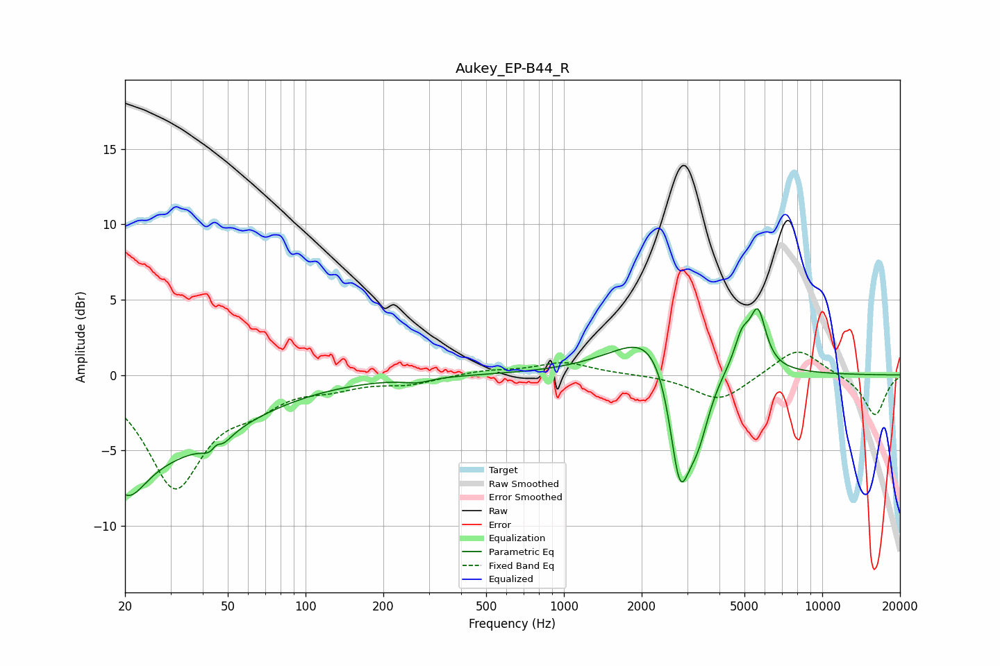

# Aukey_EP-B44_R
See [usage instructions](https://github.com/jaakkopasanen/AutoEq#usage) for more options and info.

### Parametric EQs
Apply preamp of -4.5 dB when using parametric equalizer.

|   # | Type    |   Fc (Hz) |    Q |   Gain (dB) |
|-----|---------|-----------|------|-------------|
|   1 | Peaking |        20 | 2.1  |        -2.8 |
|   2 | Peaking |        23 | 0.4  |        -5.2 |
|   3 | Peaking |        45 | 4.56 |        -3.4 |
|   4 | Peaking |        45 | 5.84 |         2.8 |
|   5 | Peaking |       271 | 2.74 |        -0.3 |
|   6 | Peaking |      2381 | 0.97 |         3.9 |
|   7 | Peaking |      2805 | 3.37 |        -8.2 |
|   8 | Peaking |      3297 | 2.78 |        -4.4 |
|   9 | Peaking |      4890 | 4.65 |         1.9 |
|  10 | Peaking |      5637 | 4.46 |         3.7 |

### Fixed Band EQs
When using fixed band (also called graphic) equalizer, apply preamp of **-1.6 dB** (if available) and set gains manually with these parameters.

|   # | Type    |   Fc (Hz) |    Q |   Gain (dB) |
|-----|---------|-----------|------|-------------|
|   1 | Peaking |        31 | 1.41 |        -7.3 |
|   2 | Peaking |        62 | 1.41 |        -1.5 |
|   3 | Peaking |       125 | 1.41 |        -0.6 |
|   4 | Peaking |       250 | 1.41 |        -0.5 |
|   5 | Peaking |       500 | 1.41 |         0.3 |
|   6 | Peaking |      1000 | 1.41 |         0.8 |
|   7 | Peaking |      2000 | 1.41 |         0   |
|   8 | Peaking |      4000 | 1.41 |        -1.8 |
|   9 | Peaking |      8000 | 1.41 |         1.9 |
|  10 | Peaking |     16000 | 1.41 |        -2.7 |

### Graphs

