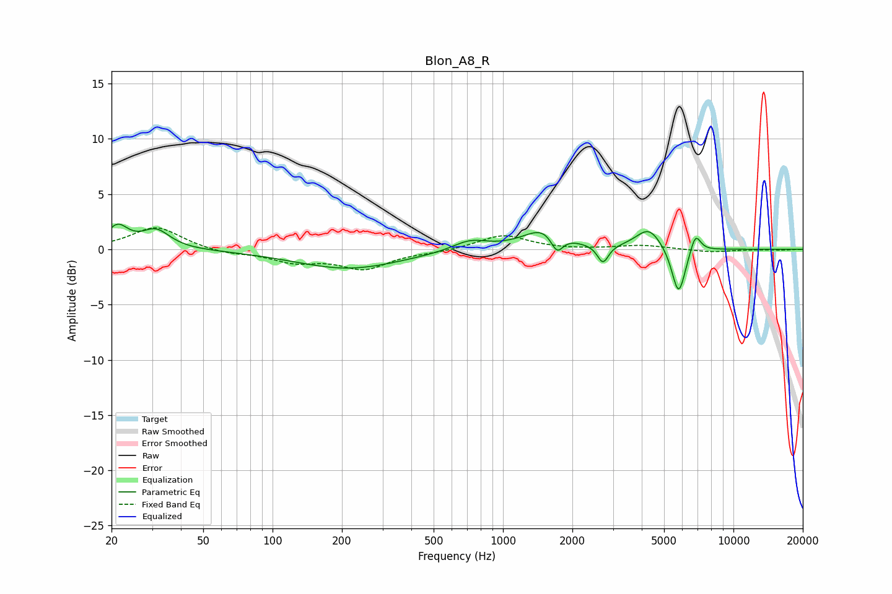

# Blon_A8_R
See [usage instructions](https://github.com/jaakkopasanen/AutoEq#usage) for more options and info.

### Parametric EQs
Apply preamp of -2.4 dB when using parametric equalizer.

|   # | Type    |   Fc (Hz) |    Q |   Gain (dB) |
|-----|---------|-----------|------|-------------|
|   1 | Peaking |        21 | 3.08 |         1.9 |
|   2 | Peaking |        31 | 2.36 |         1.7 |
|   3 | Peaking |       214 | 0.61 |        -1.7 |
|   4 | Peaking |       719 | 1.86 |         0.9 |
|   5 | Peaking |      1518 | 1.6  |         1.9 |
|   6 | Peaking |      1714 | 5.18 |        -1.7 |
|   7 | Peaking |      2716 | 5.99 |        -1.7 |
|   8 | Peaking |      4299 | 2.49 |         1.9 |
|   9 | Peaking |      5782 | 4.64 |        -4.4 |
|  10 | Peaking |      6841 | 5.99 |         1.8 |

### Fixed Band EQs
When using fixed band (also called graphic) equalizer, apply preamp of **-2.0 dB** (if available) and set gains manually with these parameters.

|   # | Type    |   Fc (Hz) |    Q |   Gain (dB) |
|-----|---------|-----------|------|-------------|
|   1 | Peaking |        31 | 1.41 |         2.1 |
|   2 | Peaking |        62 | 1.41 |        -0.4 |
|   3 | Peaking |       125 | 1.41 |        -1   |
|   4 | Peaking |       250 | 1.41 |        -1.7 |
|   5 | Peaking |       500 | 1.41 |        -0.2 |
|   6 | Peaking |      1000 | 1.41 |         1.3 |
|   7 | Peaking |      2000 | 1.41 |        -0   |
|   8 | Peaking |      4000 | 1.41 |         0.4 |
|   9 | Peaking |      8000 | 1.41 |        -0.3 |
|  10 | Peaking |     16000 | 1.41 |        -0.1 |

### Graphs

