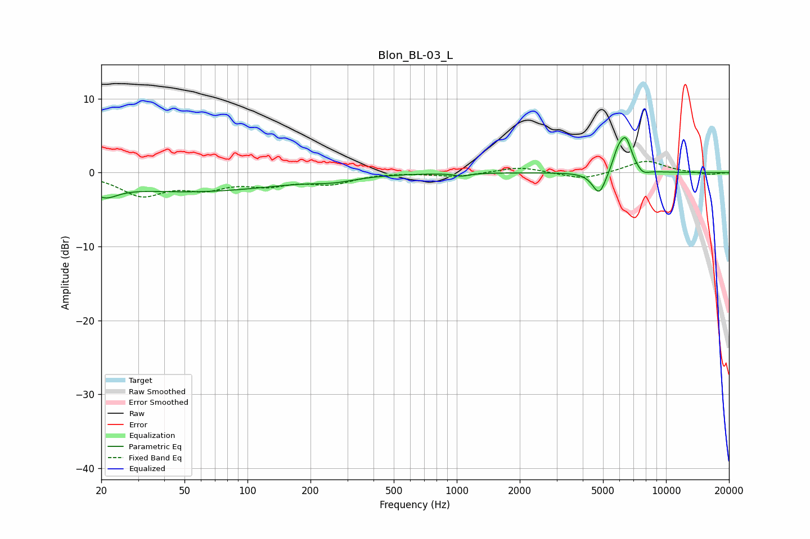

# Blon_BL-03_L
See [usage instructions](https://github.com/jaakkopasanen/AutoEq#usage) for more options and info.

### Parametric EQs
Apply preamp of -4.9 dB when using parametric equalizer.

|   # | Type    |   Fc (Hz) |    Q |   Gain (dB) |
|-----|---------|-----------|------|-------------|
|   1 | Peaking |        20 | 2.92 |         1.3 |
|   2 | Peaking |        20 | 2.44 |        -3.1 |
|   3 | Peaking |        55 | 0.33 |        -2.5 |
|   4 | Peaking |       259 | 1.38 |        -0.6 |
|   5 | Peaking |      1057 | 4.36 |        -0.4 |
|   6 | Peaking |      4798 | 4.32 |        -3.2 |
|   7 | Peaking |      5876 | 5.38 |         1.9 |
|   8 | Peaking |      6421 | 4.44 |         4.3 |
|   9 | Peaking |      7810 | 5.1  |        -1.2 |
|  10 | Peaking |      7877 | 6    |         0.5 |

### Fixed Band EQs
When using fixed band (also called graphic) equalizer, apply preamp of **-1.6 dB** (if available) and set gains manually with these parameters.

|   # | Type    |   Fc (Hz) |    Q |   Gain (dB) |
|-----|---------|-----------|------|-------------|
|   1 | Peaking |        31 | 1.41 |        -2.9 |
|   2 | Peaking |        62 | 1.41 |        -1.8 |
|   3 | Peaking |       125 | 1.41 |        -1.4 |
|   4 | Peaking |       250 | 1.41 |        -1.3 |
|   5 | Peaking |       500 | 1.41 |         0.1 |
|   6 | Peaking |      1000 | 1.41 |        -0.5 |
|   7 | Peaking |      2000 | 1.41 |         0.8 |
|   8 | Peaking |      4000 | 1.41 |        -1   |
|   9 | Peaking |      8000 | 1.41 |         1.7 |
|  10 | Peaking |     16000 | 1.41 |        -0.3 |

### Graphs

