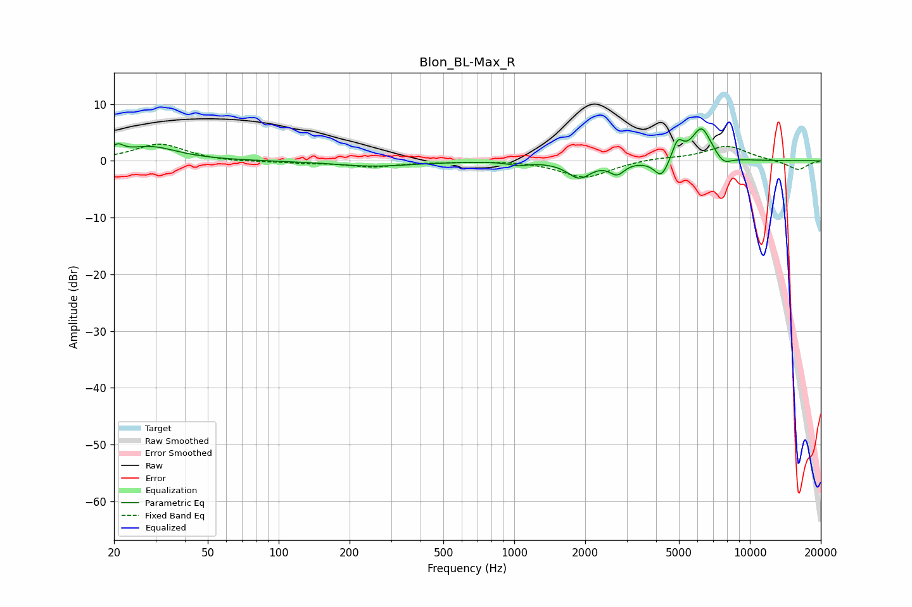

# Blon_BL-Max_R
See [usage instructions](https://github.com/jaakkopasanen/AutoEq#usage) for more options and info.

### Parametric EQs
Apply preamp of -5.7 dB when using parametric equalizer.

|   # | Type    |   Fc (Hz) |    Q |   Gain (dB) |
|-----|---------|-----------|------|-------------|
|   1 | Peaking |        21 | 5.73 |         1.5 |
|   2 | Peaking |        28 | 1.24 |         2.4 |
|   3 | Peaking |       252 | 0.87 |        -0.9 |
|   4 | Peaking |      1040 | 3.86 |        -0.6 |
|   5 | Peaking |      1885 | 2.92 |        -2.9 |
|   6 | Peaking |      2732 | 4.67 |        -2   |
|   7 | Peaking |      4217 | 4.55 |        -3.3 |
|   8 | Peaking |      4938 | 5.96 |         3.2 |
|   9 | Peaking |      6236 | 3.21 |         5.9 |
|  10 | Peaking |      7724 | 3.92 |        -1.5 |

### Fixed Band EQs
When using fixed band (also called graphic) equalizer, apply preamp of **-3.0 dB** (if available) and set gains manually with these parameters.

|   # | Type    |   Fc (Hz) |    Q |   Gain (dB) |
|-----|---------|-----------|------|-------------|
|   1 | Peaking |        31 | 1.41 |         3   |
|   2 | Peaking |        62 | 1.41 |        -0.2 |
|   3 | Peaking |       125 | 1.41 |        -0.3 |
|   4 | Peaking |       250 | 1.41 |        -1   |
|   5 | Peaking |       500 | 1.41 |        -0.1 |
|   6 | Peaking |      1000 | 1.41 |         0.1 |
|   7 | Peaking |      2000 | 1.41 |        -3   |
|   8 | Peaking |      4000 | 1.41 |         0.5 |
|   9 | Peaking |      8000 | 1.41 |         2.6 |
|  10 | Peaking |     16000 | 1.41 |        -1.6 |

### Graphs

