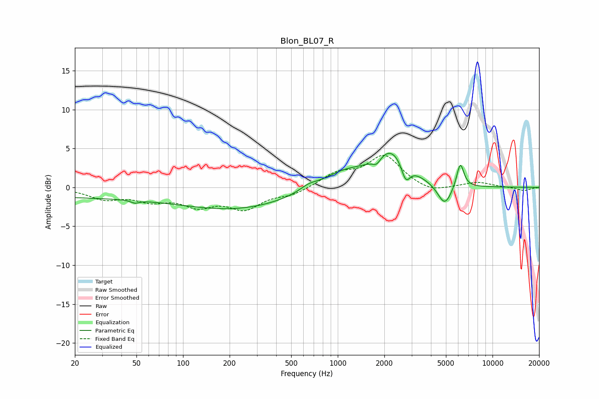

# Blon_BL07_R
See [usage instructions](https://github.com/jaakkopasanen/AutoEq#usage) for more options and info.

### Parametric EQs
Apply preamp of -4.5 dB when using parametric equalizer.

|   # | Type    |   Fc (Hz) |    Q |   Gain (dB) |
|-----|---------|-----------|------|-------------|
|   1 | Peaking |        30 | 0.18 |        -1.3 |
|   2 | Peaking |        49 | 5.91 |        -0.3 |
|   3 | Peaking |       244 | 0.42 |        -2.4 |
|   4 | Peaking |       648 | 2.41 |         0.7 |
|   5 | Peaking |      1089 | 1    |         1.9 |
|   6 | Peaking |      1784 | 5.28 |        -0.9 |
|   7 | Peaking |      2220 | 1.28 |         4.5 |
|   8 | Peaking |      2751 | 5    |        -2.4 |
|   9 | Peaking |      4911 | 3    |        -2.8 |
|  10 | Peaking |      6189 | 5.81 |         3.3 |

### Fixed Band EQs
When using fixed band (also called graphic) equalizer, apply preamp of **-4.2 dB** (if available) and set gains manually with these parameters.

|   # | Type    |   Fc (Hz) |    Q |   Gain (dB) |
|-----|---------|-----------|------|-------------|
|   1 | Peaking |        31 | 1.41 |        -1.3 |
|   2 | Peaking |        62 | 1.41 |        -1.4 |
|   3 | Peaking |       125 | 1.41 |        -2.1 |
|   4 | Peaking |       250 | 1.41 |        -2.5 |
|   5 | Peaking |       500 | 1.41 |        -0.9 |
|   6 | Peaking |      1000 | 1.41 |         1.7 |
|   7 | Peaking |      2000 | 1.41 |         4   |
|   8 | Peaking |      4000 | 1.41 |        -0.8 |
|   9 | Peaking |      8000 | 1.41 |         0.7 |
|  10 | Peaking |     16000 | 1.41 |        -0.4 |

### Graphs

