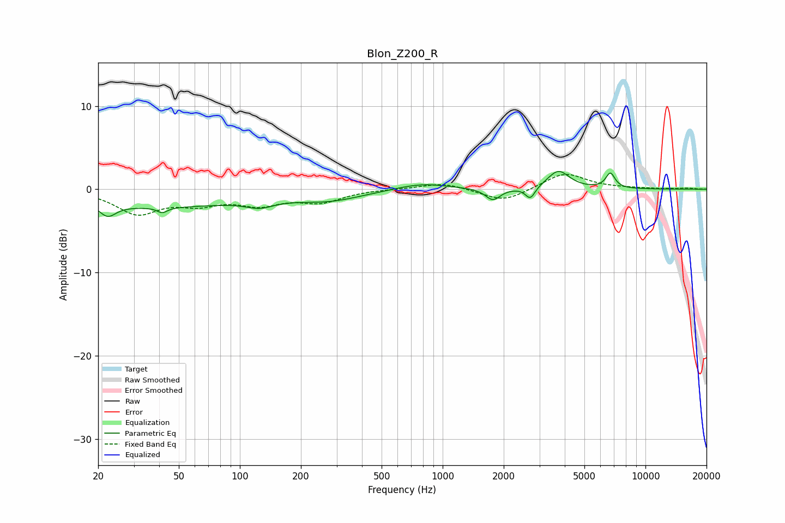

# Blon_Z200_R
See [usage instructions](https://github.com/jaakkopasanen/AutoEq#usage) for more options and info.

### Parametric EQs
Apply preamp of -2.2 dB when using parametric equalizer.

|   # | Type    |   Fc (Hz) |    Q |   Gain (dB) |
|-----|---------|-----------|------|-------------|
|   1 | Peaking |        22 | 3.58 |        -1.5 |
|   2 | Peaking |        39 | 0.34 |        -2   |
|   3 | Peaking |        41 | 5.83 |        -0.6 |
|   4 | Peaking |       125 | 2    |        -0.9 |
|   5 | Peaking |       275 | 0.84 |        -1.2 |
|   6 | Peaking |       788 | 1.08 |         0.8 |
|   7 | Peaking |      1769 | 3.91 |        -1.4 |
|   8 | Peaking |      2705 | 6    |        -1.5 |
|   9 | Peaking |      3724 | 2.64 |         2.2 |
|  10 | Peaking |      6713 | 6    |         1.8 |

### Fixed Band EQs
When using fixed band (also called graphic) equalizer, apply preamp of **-1.9 dB** (if available) and set gains manually with these parameters.

|   # | Type    |   Fc (Hz) |    Q |   Gain (dB) |
|-----|---------|-----------|------|-------------|
|   1 | Peaking |        31 | 1.41 |        -2.8 |
|   2 | Peaking |        62 | 1.41 |        -1.5 |
|   3 | Peaking |       125 | 1.41 |        -1.6 |
|   4 | Peaking |       250 | 1.41 |        -1.4 |
|   5 | Peaking |       500 | 1.41 |         0   |
|   6 | Peaking |      1000 | 1.41 |         0.8 |
|   7 | Peaking |      2000 | 1.41 |        -1.5 |
|   8 | Peaking |      4000 | 1.41 |         2   |
|   9 | Peaking |      8000 | 1.41 |         0.1 |
|  10 | Peaking |     16000 | 1.41 |         0.1 |

### Graphs

