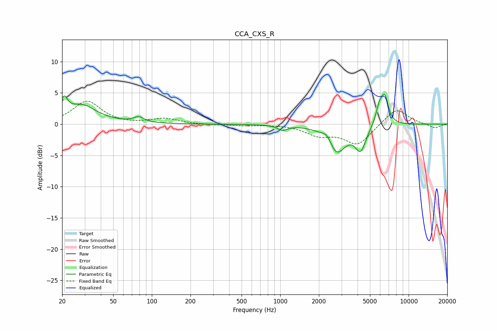

# CCA_CXS_R
See [usage instructions](https://github.com/jaakkopasanen/AutoEq#usage) for more options and info.

### Parametric EQs
Apply preamp of -4.9 dB when using parametric equalizer.

|   # | Type    |   Fc (Hz) |    Q |   Gain (dB) |
|-----|---------|-----------|------|-------------|
|   1 | Peaking |        21 | 5.63 |         2.3 |
|   2 | Peaking |        26 | 0.89 |         2.2 |
|   3 | Peaking |        30 | 1.86 |         0.9 |
|   4 | Peaking |        79 | 3.58 |         0.8 |
|   5 | Peaking |      1044 | 3.8  |        -0.8 |
|   6 | Peaking |      2335 | 3.46 |         1.6 |
|   7 | Peaking |      2722 | 1.98 |        -4.8 |
|   8 | Peaking |      4227 | 3.36 |        -3.7 |
|   9 | Peaking |      5921 | 4.82 |         2.7 |
|  10 | Peaking |      6529 | 4.81 |         4   |

### Fixed Band EQs
When using fixed band (also called graphic) equalizer, apply preamp of **-3.8 dB** (if available) and set gains manually with these parameters.

|   # | Type    |   Fc (Hz) |    Q |   Gain (dB) |
|-----|---------|-----------|------|-------------|
|   1 | Peaking |        31 | 1.41 |         3.7 |
|   2 | Peaking |        62 | 1.41 |        -0.1 |
|   3 | Peaking |       125 | 1.41 |         0.9 |
|   4 | Peaking |       250 | 1.41 |        -0.1 |
|   5 | Peaking |       500 | 1.41 |        -0.2 |
|   6 | Peaking |      1000 | 1.41 |         0   |
|   7 | Peaking |      2000 | 1.41 |        -1.6 |
|   8 | Peaking |      4000 | 1.41 |        -3.2 |
|   9 | Peaking |      8000 | 1.41 |         2.7 |
|  10 | Peaking |     16000 | 1.41 |        -0.7 |

### Graphs

